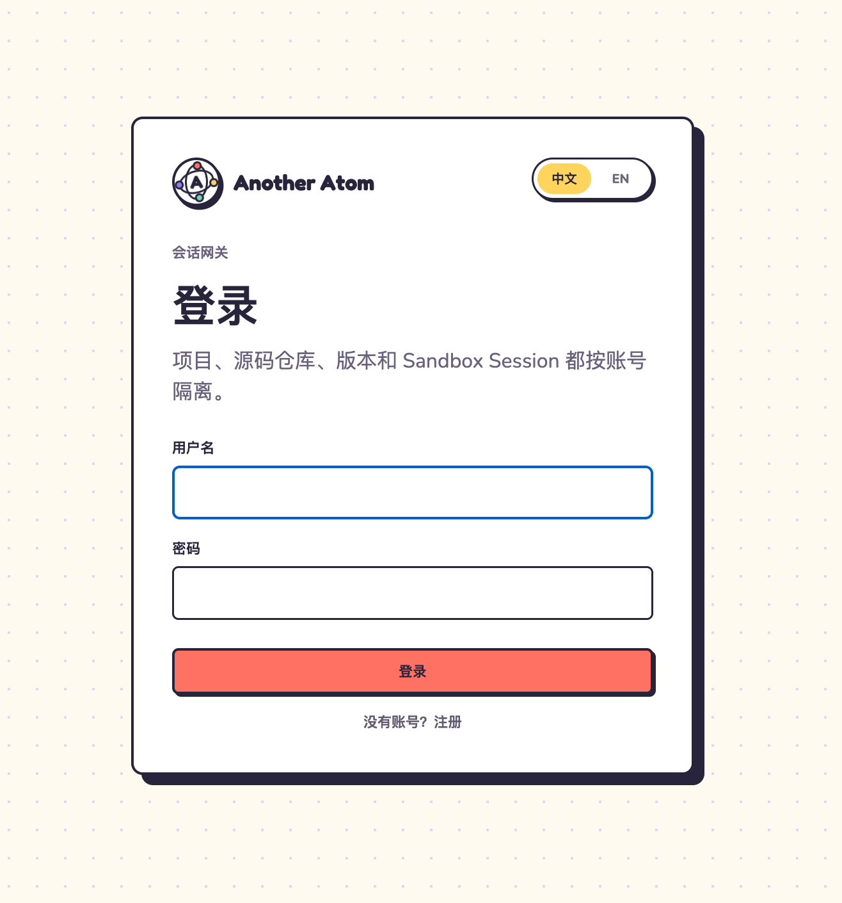
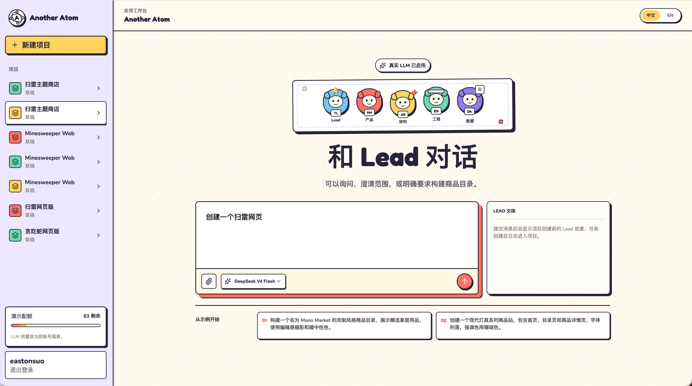
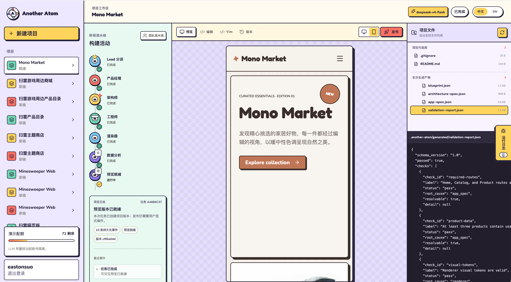
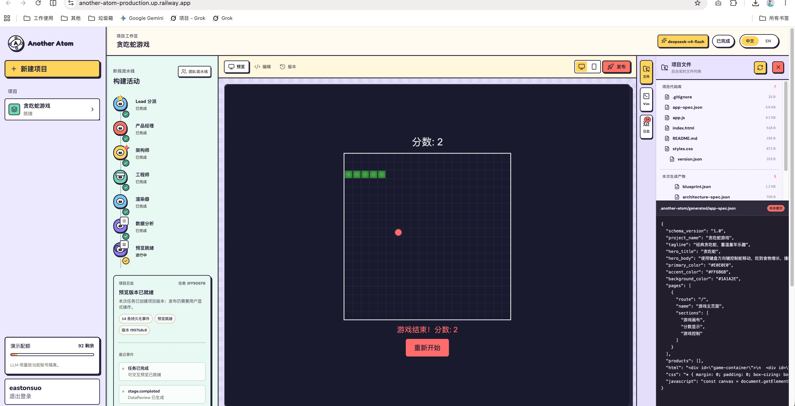
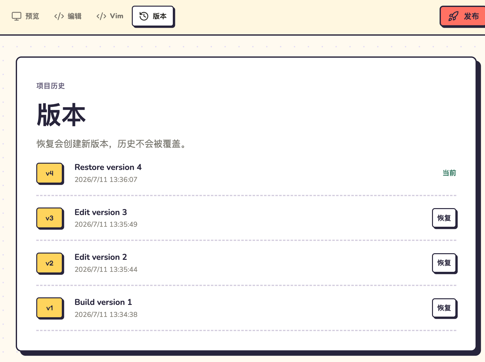

# Another Atom

[简体中文](./README.md) | [English](./README.en.md)

> Turn a rough idea into a software project whose code you can inspect, edit, version, and publish.

## Product Conclusion

Another Atom is a multi-agent Vibe Coding workspace. Users may describe any software product goal; specialist Agents plan, implement, and validate, while the Project workspace keeps source files, version history, runtime results, and publishing in one continuous development loop. Web Projects can additionally be previewed and visually edited inside Studio.

It shares [Atoms'](https://help.atoms.dev/en) core category goal: moving from intent to an online product. Another Atom uses its own brand, interaction model, contracts, and engineering implementation; it does not reuse Atoms source code, private prompts, or undisclosed infrastructure.

```text
Idea / materials / existing project
               |
               v
          Talk to Lead
               |
               v
     Multi-agent planning and execution
               |
               v
       Project code + available runtime result
               |
         +-----+-------------------+
         |                         |
         v                         v
 Run / Preview (with adapter) Inspect / edit / manage files
         |                         |
         +-----------+-------------+
                     v
          Validate / repair / version
                     |
                     v
              User-approved publish
                     |
                     v
          Continue conversation and iteration
```

See the [overall product goal and positioning](./docs/design/整体/01-[产品]-整体产品目标与定位.md) for the full decisions and trade-offs.

## Core Problems

- **From idea to implementation:** Users may start with only a goal, not a complete specification, architecture, or codebase. The system should fill the necessary gaps and produce a runnable result.
- **An opaque AI process:** A single prompt does not show what the model understood, why it implemented a solution, or where failure occurred. Specialist roles and inspectable artifacts make the process understandable and correctable.
- **Generated results are hard to continue:** One-off code or screenshots do not support sustained iteration. A Project must retain code files, current state, and version history so work can continue in place.
- **Insufficient control of code and production:** Vibe Coding must not hide source code or let new output silently replace the live version. Users inspect and edit code and explicitly choose what to publish.

## Core Product Capabilities

### Multi-agent Collaboration

- **Single entry point:** Users primarily talk to Lead and do not need to understand internal roles, modes, or workflows first.
- **Specialized responsibilities:** Product Manager, Architect, Engineer, Data Analyst, and Reviewer handle requirements, structure, implementation, data, and independent review. The deterministic Validator supplies engineering evidence Agents cannot rewrite.
- **Task-based evolution:** Simple tasks should take a short path, while complex work may involve more roles, tools, and rework. The purpose of multiple Agents is to reduce different uncertainties, not maximize Agent count.
- **User involvement:** Users can inspect, edit, and confirm key plans. The system pauses only for real changes in scope, budget, destructive operations, or publishing.

### Vibe Coding Workspace

- **Natural-language development:** Users create, explain, modify, and repair Projects through conversation without first locating files or specifying implementation steps.
- **Project-type runtime:** Preview is a Web Project capability, not the product scope boundary. Non-Web Projects still retain their source, Artifacts, and versions; direct execution or Preview appears only when a matching Runtime adapter exists.
- **Visual and code entry points:** Users can select interface elements to change content and styles, then inspect or edit source files when precise control is needed.
- **File management:** A Project exposes source, generated Artifacts, and media files for inspection, refresh, selection, and later create/update/delete workflows.
- **Continue from the current object:** Users can ask Agents to modify the current page, element, file, error, or version without describing the entire Project again.

### Project, Code, and Versions

- **Project as the core asset:** A Project is a persistent software project, not a chat transcript. Requirements, code, Agent Artifacts, versions, and publishing state all belong to it.
- **Repository ownership:** Every Project binds to a repository. Users retain visibility, editability, and portability of source code, while platform versions remain traceable to Git commits.
- **Changes create versions:** Agent Builds, user Edits, source saves, automated repairs, and Restores create new versions without overwriting history.
- **Restore preserves history:** Restoring an older version creates a new current version while retaining all earlier versions and operations.
- **Independent publish pointer:** Users may publish the latest or a selected version. Drafts, new Builds, and Restores must not silently change the live result.

### From Build to Online Product

- **Quality loop:** Build results go through explainable validation. Errors should be locatable, repairable, and verifiable instead of ending with a generic failure message.
- **Public access:** Users publish a confirmed version to a stable URL and explicitly Update it after later changes.
- **Later capabilities:** Databases, authentication, payments, domains, analytics, SEO, third-party connections, and sharing move an application prototype toward an online product, but must remain attached to the same Project and published version.
- **Continuous iteration:** Publishing is not the end. Users return to the Project to continue conversations, modifications, validation, and later releases.

## Product Interface

Login establishes a server-side Session; Projects, source repositories, versions, and Sandbox Sessions are isolated by account.

<p align="center">
  
</p>

Studio keeps Lead chat, specialist Agents, Project history, model selection, and account quota in one workspace.

<p align="center">
  
</p>

The build workspace shows durable progress, interactive Preview, Project Repository, current Run Artifacts, and logs.

<p align="center">
  
</p>

For Web Projects, generated output runs as a real Web application so users can inspect interactions, source files, and structured Artifacts. Other project types are not rewritten as Web applications merely to obtain a Preview.

<p align="center">
  
</p>

Build, Edit, and Restore create separate versions. History remains intact, and users explicitly choose the live version.

<p align="center">
  
</p>

## Overall Design Principles

These principles answer four questions: how a project keeps moving, how Agents collaborate, how the platform controls execution, and how results are saved and published.

### 1. How a project keeps moving

- **[Project carries the complete development process]** Users receive a software project they can keep changing, not a one-off response. Requirements, Agent artifacts, repository, Preview, versions, and publishing state belong to the Project, so returning users continue from existing code and state.

- **[Every editing surface points to the same Project]** Conversation captures intent, Preview verifies behavior, visual tools support quick adjustments, and source files provide precise control. Changes from every surface return to the same Project and enter the same version history.

### 2. How Agents divide and hand off work

- **[Roles collaborate through inspectable artifacts]** Lead receives user requests. Product Manager, Architect, Engineer, Data Analyst, and Reviewer own product, architecture, code, data, and independent review. Each role must deliver a Blueprint, ArchitectureSpec, source, DataProfile, ValidationReport, or ReviewReport rather than simulate collaboration through avatar count or conversation length.

- **[Each role receives only the information required by its task]** Agents do not share an endlessly growing transcript. The platform prepares the Context required by the current role and passes versioned Artifacts, Evidence, and Handoffs so inputs, outputs, and failure causes remain inspectable, recoverable, and traceable.

- **[Routine work continues; risk changes require confirmation]** Once a user explicitly requests a build, work inside the accepted scope and base budget continues automatically. If scope, budget, source safety, or public deployment state changes, the platform must ask for confirmation.

### 3. How the platform controls authority and execution

- **[Models generate; the platform executes and authorizes]** LLMs understand requirements, plan, generate code, and explain results. Platform Runtime owns identity, quota, workflow state, tool authorization, repository writes, Sandbox, and publishing. Models may propose actions but cannot bypass the platform to perform privileged operations.

- **[Every private capability confirms the user and Project]** REST, SSE, private Preview, and Terminal WebSocket connections pass through the unified Gateway, resolve the login Session, and confirm access to the relevant Run, Project, Version, and Sandbox Session. Public Routes are handled separately and read only explicitly published versions.

### 4. How project results are saved, published, and recovered

- **[Source, Git commits, and project versions stay aligned]** Every Project owns a repository. Successful builds, user edits, source saves, and Restore create ProjectVersions mapped to Git commits. Intermediate auto-repair Artifacts remain inspectable, while only validated results enter version history.

- **[Work-in-progress and published versions are managed separately]** Generation does not equal production. Project working versions can keep changing, while the Public Route displays the user's last explicit Publish/Update. Restore creates a new version without rewriting history or silently changing public content.

- **[Visible state comes from saved records]** Stages, errors, usage, artifacts, and versions come from persistent records. Refresh, Worker restart, or task recovery reuses completed work and avoids duplicate model calls, usage settlement, and version creation.

## Overall Logical Architecture

```text
User Browser
Studio / Preview / Files and Terminal UI
                    |
              HTTPS / WSS
                    v
+----------------------------------------------------+
| Unified Gateway / Control Plane                    |
| Identity | Lead / Risk | Project / Version         |
| Publish  | Event / Quota | Durable Scheduler       |
+---------------------------+------------------------+
                            |
          +-----------------+------------------+
          |                 |                  |
          v                 v                  v
      State DB        Artifacts / Repository     LLM Provider
          |                 |
          |                 v
          |             Agent Worker
          |                 |
          |                 v
          +----------> Tool Gateway
                            |
                            v
                    Sandbox Provider
                  files / build / test / Vim
```

- **Control Plane:** owns trusted identity, Project ownership, state, quota, versions, and publish pointers.
- **Agent Runtime:** assembles the necessary Context, invokes models, validates results, and saves Artifacts without bypassing platform authority.
- **Repository:** stores Project source, Git history, and commit/version mappings.
- **Tool Gateway:** evaluates tool requests against user, Project, Agent role, path, network, and budget policy.
- **Sandbox:** runs untrusted file changes, builds, and tests without authority over identity, quota, or publishing.

### Agent and Runtime Execution Flow

```text
User message
    |
    v
LeadDecision -------- direct --------> Answer / clarification
    |
   team
    v
Blueprint -> Risk Policy -> TaskGraph / Fixed Pipeline
                              |
                              v
                  Minimal Agent Context + Artifact Handoff
                              |
                              v
                    ToolRequest -> Sandbox
                              |
                              v
          DataProfile + Validation + ReviewReport
                              |
                              v
                   Git commit + ProjectVersion
                              |
                              v
                   explicit Publish / Update
                              |
                              v
                         Public Route
```

- **Planning and execution stay separate:** Lead may propose direct, team, or TaskGraph behavior; Runtime validates roles, dependencies, budget, Approval, and Tool authority.
- **Models and evidence stay separate:** Agents produce structured judgments; Renderer, Test, Validator, and ToolResult provide execution evidence that models cannot rewrite.
- **Work and publishing stay separate:** Agent Runs and ProjectVersions may continue evolving, while the Public Route follows only the user's last explicit publish pointer.

### Deployment and Sharing Architecture

This separates two actions: developers deploy the Another Atom platform, while users publish and share a ProjectVersion inside the product. The former creates trusted service boundaries; the latter changes only the product's publish pointer.

```text
Platform deployment

Developer -- git push --> GitHub
                           |
                        Deploy
                           |
             +-------------+-------------+
             |                           |
             v                           v
        Control Plane               Agent Workers
             |                           |
       +-----+------+              +-----+-----------+
       |            |              |       |         |
       v            v              v       v         v
   State DB   Artifact Storage   LLM    state/data   Sandbox Provider

User access and sharing

Browser -- HTTPS / WSS --> Unified Gateway
                              |
               +--------------+--------------+
               |                             |
               v                             v
      Authenticated Studio             Published Route
       Project / Edit / Vim            selected Version
               |                             |
               `---- explicit Publish -------'
                                             |
                                             v
                                      Stable Public URL
```

- **One public entry:** the browser reaches only the Control Plane HTTPS/WSS domain; internal Workers, databases, artifact storage, and Sandboxes are not exposed to end users.
- **Deployment boundary:** versions may combine or split Control Plane, Agent Worker, and Sandbox components, but trusted control authority and untrusted execution must not share privileges.
- **Sharing boundary:** the Public Route reads only the published version and does not expose the Project Repository, Agent Context, internal Events, quota, or Sandbox Sessions.

Version-specific engineering boundaries remain in each architecture document; the README does not duplicate implementation details.

## Current Versions

| Version | How it advances the overall goal | Status and design sources |
| --- | --- | --- |
| **V1** | Proves the complete loop with a fixed specialist team, Project Git, versions, and explicit publishing; the Web source and browser Preview adapter is the currently implemented path | Railway single-replica accepted; non-Web Runtime adapters and target Linux Sandbox isolation acceptance remain. See [V1 product](./docs/design/V1/产品设计/01-核心产品需求与交互.md), [V1 Agent](./docs/design/V1/技术设计/01-[Agent]-多Agent设计.md), and [V1 architecture](./docs/design/V1/技术设计/03-[工程]-系统架构.md) |
| **V2** | Adds dynamic task graphs, role subsets, tools, selective parallelism, and rework on the same Project, Artifact, and authority foundations | Designed, not implemented. See [V2 product](./docs/design/V2/产品设计/01-产品范围与交互.md), [V2 Agent](./docs/design/V2/技术设计/01-[Agent]-任务编排与多Agent协作.md), and [V2 architecture](./docs/design/V2/技术设计/02-[工程]-多Agent执行与沙箱架构.md) |

The current code includes real and Mock LLM providers, user isolation, Project Git, interactive Preview for Web Projects, versions and publishing, durable jobs, and Provider fallback. The backend currently collects 85 unit/integration tests. See the [V1 delivery status snapshot](./docs/review/归档/11-[综合]-2026-07-13-V1交付状态摘要.md) and [V1 review](./docs/review/归档/08-[综合]-2026-07-12-关键设计与实现检查.md) for detailed completion status.

## Quick Start

### Requirements

- Python ≥ 3.12
- [uv](https://docs.astral.sh/uv/)
- Node.js ≥ 22 and npm

Local development defaults to SQLite and a deterministic Mock Provider, with no API key required. See the [run and deployment guide](./docs/design/V1/技术设计/04-[工程]-运行与部署.md) for Ollama Cloud and DeepSeek configuration.

### 1. Install backend dependencies

```bash
uv sync --python 3.12
```

### 2. Build Studio

```bash
cd studio
npm install
npm run build
cd ..
```

### 3. Start the backend

```bash
uv run --python 3.12 uvicorn another_atom.main:app --host 127.0.0.1 --port 8000
```

Open:

- Studio: [http://127.0.0.1:8000](http://127.0.0.1:8000)
- Health: [http://127.0.0.1:8000/api/health](http://127.0.0.1:8000/api/health)
- API docs: [http://127.0.0.1:8000/docs](http://127.0.0.1:8000/docs)

Local data is stored in `data/another_atom.db`. xterm.js + restricted Vim additionally requires a Linux Sandbox Host, Sandbox image, and shared secret.

## Documentation

- **Complete knowledge base (Chinese):** [Full project design knowledge base](./PROJECT_KNOWLEDGE_BASE.md)
- **Overall product:** [Overall product goal and positioning (Chinese)](./docs/design/整体/01-[产品]-整体产品目标与定位.md)
- **Design:** [Design documentation index](./docs/design/README.md)
- **Review:** [Inspection, reflection, and bug index](./docs/review/README.md)
- **Deployment:** [Run and deployment guide](./docs/design/V1/技术设计/04-[工程]-运行与部署.md)
- **Atoms reference:** [Atoms reference product analysis](./docs/design/整体/02-[参考]-Atoms参考产品分析.md)

## Project Status

- **Source:** [github.com/eastonsuo/another-atom](https://github.com/eastonsuo/another-atom)
- **Online:** Railway deployment and public access have been accepted; the service domain is managed by the Railway environment.
- **Current limits:** target Linux Sandbox security acceptance, a complete Project conversation thread, failure Retry/Resolve, and backend-dependent product capabilities remain future work.
