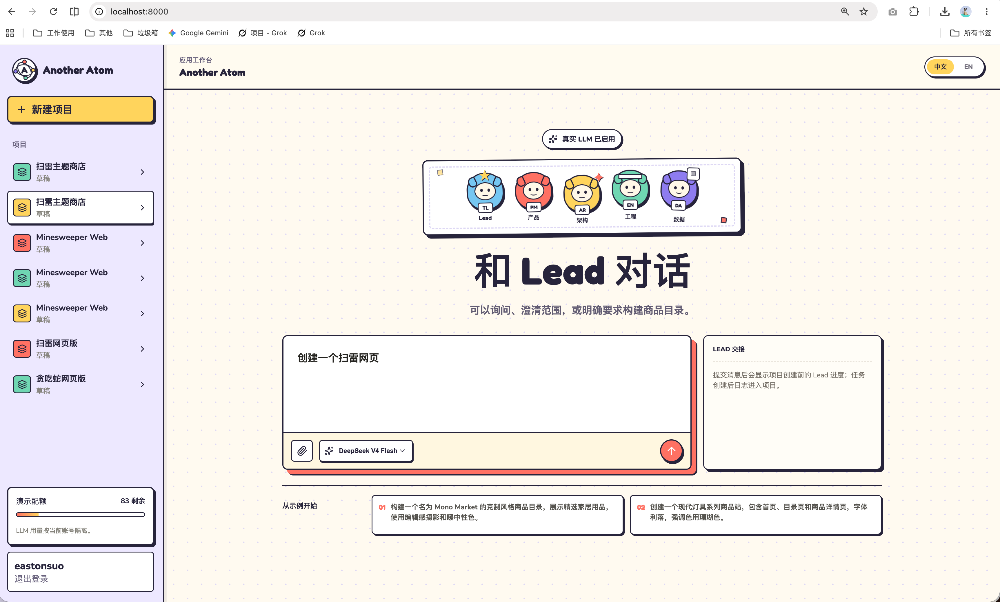

# Another Atom

[简体中文](./README.md) | [English](./README.en.md)

> 把产品想法转化为可检查、可修改、可管理版本并可发布的网页原型。

## 产品界面


登录页通过用户名和密码建立会话；Project、源码仓库、版本和 Sandbox Session 都按账号隔离。



中文 Studio 将 Lead 对话入口、固定专业团队、Project 历史、模型选择和账号级配额放在同一工作区；进入构建后继续展示阶段进度、运行日志、文件树、预览、版本和发布状态。


构建工作区同时展示可持久化的角色进度、可交互 Preview、Project Repository 与当前 Run Artifact。文件/Vim 和运行日志默认收起为右侧工具入口，需要时展开，不持续挤压主画布。


版本历史区分 Build、Edit 和 Restore 来源。Restore 只创建新的 ProjectVersion 与 Git commit，旧版本不会被覆盖；线上版本仍由用户显式 Publish/Update 决定。

## 先认识几个核心概念

下文会反复出现几个关键词，先用大白话解释一遍：

- **Lead（入口分派）：** 你发的每条消息都先经过 Lead。它判断你是只想询问或澄清——走 `direct`，直接回答且不创建 Project；还是明确要求构建——走 `team`，交给专业团队执行。

- **Blueprint（产品方案）：** Product Manager 保留用户原始产品目标，把需求补全为可检查方案，写清页面、模块、交互、状态和视觉方向。`supported` 表示可以直接实现为离线 Web 应用；`adapted` 表示产品目标不变，但真实认证、支付、数据库写入或外部服务需要改成明确的本地演示能力并等待确认；`unsupported` 只用于主要目标无法由 Web Runtime 表达的情况。PM 不得把游戏、工具或看板改写成商品目录。

- **角色接力：** 一次 V1 构建由四个 AI 角色按固定顺序接力。每一步都产出可检查的结构化成果，而不是让多个角色互相闲聊。

  ```text
  Product Manager -> Architect -> Engineer -> Data Analyst
      Blueprint    ArchitectureSpec  Web AppSpec    DataReview
      产品方案          架构规格        网页源码规格    数据/校验解读
  ```

- **版本与发布：** 每次 Build、Edit、Vim Save 和 Restore 都保存为新的 ProjectVersion，并对应一次 Git commit；但是否上线、上线哪个版本，必须由用户显式 Publish/Update，系统不会自动把新改动推到线上。

- **Sandbox（隔离沙箱）：** 真正修改文件、运行 Vim 和执行构建的动作放在独立隔离环境中。Sandbox 只拿到当前 Project 的最小输入，不获得平台数据库凭证和 Provider 密钥，从而把“AI/工具执行”与“平台权限”分开。

## 快速开始（本地运行）

本地运行分为后端 API 和前端 Studio。只验证接口时可以只启动后端；查看完整界面时，需要先构建一次前端产物，再由后端以同域页面提供。

- **前置要求：** Python ≥ 3.12、[uv](https://docs.astral.sh/uv/)、Node.js ≥ 22 和 npm。

- **默认配置：** 本地使用 SQLite 和确定性 Mock Provider，不需要 API Key。Ollama Cloud / DeepSeek 等真实模型是可选配置，详见[本地运行与 Railway 部署说明](./docs/v1/local-run-and-railway-deployment.md)。

### 1. 安装后端依赖

在仓库根目录执行：

```bash
uv sync --python 3.12
```

### 2. 构建 Studio 界面（只使用 API 时可跳过）

```bash
cd studio
npm install
npm run build
cd ..
```

前端产物会写入 `studio/dist`，后端启动后会自动将其挂载为同域页面。

### 3. 启动后端

```bash
uv run --python 3.12 uvicorn another_atom.main:app --host 127.0.0.1 --port 8000
```

启动后可以访问：

- **Studio：** [http://127.0.0.1:8000](http://127.0.0.1:8000)

- **健康检查：** [http://127.0.0.1:8000/api/health](http://127.0.0.1:8000/api/health)，返回 `{"status":"ok", ...}` 即表示后端和数据库可用。

- **API 文档：** [http://127.0.0.1:8000/docs](http://127.0.0.1:8000/docs)

- **本地数据：** 默认保存在 `data/another_atom.db`；重启后 Project 和版本仍然存在。需要干净数据时，先停止服务，再删除该文件。

- **Vim 边界：** 默认 Mock 流程可完成登录、生成、Preview、结构化 Edit、版本和发布；xterm.js + restricted Vim 还需要单独启动 Linux Sandbox Host、构建 Sandbox 镜像并配置共享密钥。

## 1. 产品定位

Another Atom 是一个通过自然语言创建网页应用的 AI Agent 工作台。用户可以提出任意产品需求；团队保留原始目标，将其实现为可运行、可检查、可修改、可管理版本并可发布的 Web 应用。

本项目受 [Atoms](https://atoms.dev/) 启发，但采用独立的产品与技术设计。它延续多角色协作的产品表达，不复用 Atoms 的源代码、私有 Prompt 或内部基础设施，也不是 Atoms 的复刻或分支。

- **当前范围：** V1 接受任意产品需求，并生成自包含的 HTML/CSS/JavaScript。纯前端交互直接实现；真实后端、数据库写入、认证、支付、外部网络、原生系统能力和动态依赖属于明确的能力边界，不能靠改变产品类型绕过。

- **模型接入：** 后端已实现 Ollama Cloud 和确定性 Mock Provider。DeepSeek V4 Pro 的真实 Lead 结构化调用已经成功，也允许选择 V4 Flash；完整四角色真实链路仍待验收。

- **本地状态：** Lead 路由、固定专业团队、风险审批、Session Gateway、用户隔离、Project Git、版本、发布路由和 Sandbox Gateway 已有本地实现与自动化测试。

- **线上状态：** Railway 单副本、SQLite/Project Git 持久化 Volume 和公开访问已完成验收；目标 Linux Sandbox Host 的实机安全验收仍待完成。

## 2. 当前边界摘要

1. **Agent 边界：** Lead 对每条消息只做 `direct/team` 二选一路由；`team` 固定执行 Product Manager → Architect → Engineer → Data Analyst。`supported` Blueprint 在受控范围和基础预算内自动继续，`adapted` 或新增风险才请求确认。动态角色子集、局部并行、返工仲裁和独立 Agent Context 属于 V2。

2. **工程边界：** V1 Control Plane 只面向本地单实例或 Railway 单副本，使用进程内调度、单 Worker 和 SQLite 持久化检查点；Railway 将数据库和 Project Git 放在持久化 Volume。浏览器通过统一 Gateway 访问 Control Plane；Vim/Terminal 代理到独立 Linux Sandbox Host。

3. **安全边界：** 生产身份来自用户名密码和服务端 Session Cookie，不接受客户端自报 `user_id`；`X-User-ID` 只在测试环境保留。Project、Run、Preview、Git 和 Sandbox Session 都绑定当前用户。

4. **交付边界：** Build、Edit、Vim Save 和 Restore 形成新的 ProjectVersion 与 Git commit，但不会自动改变线上发布指针。Publish、Update 和 Unpublish 必须由用户显式触发。

## 3. 版本规划

| 版本 | 产品目标 | Agent 组织方式 | 当前状态 |
| --- | --- | --- | --- |
| **V1** | 交付有登录隔离、代码归属、可恢复版本和公开分享能力的完整链路 | Lead 选择 `direct`，或调用完整的 Product Manager → Architect → Engineer → Data Analyst 团队 | Railway 单副本已验收；Linux Sandbox 实机安全验收待完成 |
| **V2** | 增加动态任务图、角色子集、局部并行、结构化返工和仲裁 | Lead 在 Runtime 约束下动态协调 Product Manager、Architect、Engineer、Data Analyst | 已完成产品、架构与 Agent 设计，待 V1 验收后实施 |

- **实施顺序：** 项目按 V1 → V2 推进。V1 是当前实现与验收基线，V2 是明确计划实施的下一版本，不是泛化的远期愿景。

- **角色延续：** V2 不新增没有定义的展示型角色，而是升级 Lead 的协调能力，并让现有四个专业 Agent 按真实依赖执行。

- **详细设计：** V1 的具体取舍见 [`docs/v1/`](./docs/v1/)，V2 的 TaskGraph、Context、Tool、Sandbox 和预算设计见 [`docs/v2/`](./docs/v2/)。

## 4. V1 用户体验

- **登录与隔离：** 用户通过用户名密码登录；切换账号后，只能看到当前账号拥有的 Project、Run、Preview、版本和 Sandbox Session。

- **对话与路由：** 用户始终从 Lead 入口表达需求。询问、能力确认或澄清走 `direct`；明确构建请求走 `team`，用户也可以主动选择 Call team。

- **范围与确认：** Product Manager 将请求整理成 Blueprint，并始终保留原始产品目标。`supported` Web 工作自动进入固定团队；`adapted` 只调整不可用的技术能力并展示取舍；`unsupported` 停止原请求且不创建 Build Job。用户可以确认当前草案，也可以显式要求 PM 围绕原目标重新生成需求。

- **设计与实现：** Architect 产生 ArchitectureSpec，Engineer 产生包含 HTML/CSS/JavaScript 的 AppSpec；Runtime 将源码写入 Project Git，并在无同源权限、禁网络的 iframe 中运行 Preview。Validator 检查源码完整性、离线边界、Blueprint 页面交接和视觉 Token，不执行模型生成的 Shell 命令。

- **质量解释：** ValidationReport 保存不可由 Agent 改写的工程证据，Data Analyst 基于 AppSpec 和校验结果生成 DataReview，不把失败检查解释成成功。

- **预览与修改：** 用户可以直接操作生成应用的真实交互，通过结构化 Edit 修改主要文案和颜色；Project Git 同时保存 `index.html`、`styles.css`、`app.js` 和 `app-spec.json`。受限 Vim 仍需独立 Sandbox Host。

- **文件可见：** Workspace 右侧通过受用户归属校验的 HTTP API 实时列出 Project Git 的真实 Web 源码和当前 Run 的结构化产物，并支持刷新与内容查看。尚未形成版本的 Blueprint、ArchitectureSpec、AppSpec 和 ValidationReport 标记为“本次生成产物”，不伪装成已提交代码。

- **Provider 兜底：** 所有结构化角色调用优先通过 Ollama Cloud 使用 DeepSeek V4，Lead 关闭无必要的 thinking。配置 `DEEPSEEK_API_KEY` 后，Ollama 单次请求超过 30 秒才切换一次 DeepSeek 官方 API；普通 HTTP 错误不会触发该兜底。界面显示“服务商切换中”，Run 阶段保存 `provider.fallback` 事件，两次请求用量一起结算。完整配置见[本地运行与 Railway 部署说明](./docs/v1/local-run-and-railway-deployment.md#24-配置真实模型与-deepseek-兜底)。

- **版本与恢复：** Build、Edit、Vim Save 和 Restore 都创建新的 ProjectVersion 与 Git commit；Restore 只新增恢复版本，不删除或重写历史。

- **发布与分享：** 用户选择一个 ProjectVersion 后显式 Publish 或 Update；公开 URL 只读取已确认的发布指针，新工作版本不会自动上线。

## 5. V1 能力地图

```text
产品链路：登录（Login） -> Lead 路由
                              |-- 直接回答（direct）
                              `-- 团队构建（team） -> 产品方案（Blueprint）
                                                      -> 构建（Build）
                                                      -> 预览（Preview）

协作链路：产品经理（Product Manager） -> 架构师（Architect）
                                         -> 工程师（Engineer）
                                         -> 数据分析师（Data Analyst）
             |                              |                  |                  |
        产品方案                       架构规格           应用规格          数据与质量解读
       （Blueprint）             （ArchitectureSpec） （AppSpec）       （DataReview）

源码链路：项目（Project） -> 本地 Git 仓库（local Git）
                           -> 沙箱临时工作区（Sandbox worktree）
                           -> Vim 保存（Vim Save）
                           -> Git 提交（commit）

版本链路：构建 / 编辑 / 恢复（Build / Edit / Restore）
                           -> 项目版本（ProjectVersion）
                           -> 显式发布（explicit Publish）
                           -> 公开地址（Public URL）

保障链路：会话隔离（Session isolation） | 配额（Quota）
         | 任务恢复（Job recovery） | 确定性校验（Validation）
         | 审计事件（Audit events）
```

- **可检查：** Blueprint、ArchitectureSpec、AppSpec、ValidationReport 和 DataReview 都是持久化 Contract，不依赖不可见的 Agent 私有推理解释结果。

- **可操作：** Preview 是可交互页面，不是静态截图；Studio 中可见的构建、编辑、版本、恢复和发布控件都对应真实后端行为。

- **可恢复：** Run、Job、Artifact、配额和版本状态持久化；刷新或 Worker 重启不会要求用户从头重新生成已完成阶段。

- **可归属：** 每个 Project 绑定当前用户和一个服务端本地 Git 仓库，每个保存版本都能定位到 commit。

- **可控制：** LLM 只能提交结构化决策；身份、配额、状态推进、仓库写入、Sandbox 和发布权限由 Runtime 掌握。

## 6. 设计亮点与关键取舍

Another Atom 的核心不是让多个 Agent 同时说话，而是把多角色协作、结构化 Context、风险驱动的人机协同、源码归属、版本恢复和隔离执行组合成一条可检查、可控制、可交付的产品链。本章描述最终产品应长期保持的设计原则；V1 因范围和部署条件做出的暂时收敛，放在下一章单独说明。

### 6.1 【角色分工】多角色不是一起聊天，而是明确分工

使用多个 Agent，不等于让几个角色围绕同一个问题反复发表意见。Another Atom 延续 Atoms 的多角色设计，但给每个角色分配不同职责：前一个角色完成一项明确工作，并留下可以保存、检查、供下一个角色继续使用的正式结果。这里所说的“产物（Artifact）”，就是 Blueprint、ArchitectureSpec、AppSpec 这类不会随着聊天结束而消失的结构化结果。

- **Lead：** 判断用户是在询问/澄清，还是明确要求系统执行；进入执行后负责协调建议，不直接拥有文件、Shell 或发布权限。

- **Product Manager：** 将用户目标映射为 Blueprint，明确支持范围、页面、模块、视觉方向、映射需求和省略需求。

- **Architect：** 将 Blueprint 转换为 ArchitectureSpec，定义路由、数据实体、视觉 Token 和 Renderer 边界。

- **Engineer：** 将已确认的产品与架构 Contract 转换为 AppSpec，并对真实构建和校验证据负责。

- **Data Analyst：** 检查数据完整性并解释 ValidationReport，不取代确定性工程校验，也不设置独立 Designer 或 QA 展示角色。

- **关键取舍：** 角色数量服从职责边界，不为制造“多 Agent 感”增加角色。新增角色必须回答它消除了哪类独立不确定性，以及交付什么可验证 Contract。

### 6.2 【上下文交接】角色只接收必要信息，结果可以检查和恢复

多 Agent 最直接的做法，是把用户和前面所有角色的完整聊天记录继续传给下一个角色。但随着对话变长，后面的 Agent 会收到大量与当前任务无关的信息：既增加模型成本，也容易混淆已经确认的结论、临时讨论和失败尝试；服务重启后，系统也很难只根据一段聊天判断哪些工作已经真正完成。

Another Atom 选择让每个角色交付一份格式明确、可以保存和校验的成果。下一个角色主要读取已经确认的上游成果，而不是重新理解此前的全部对话：

```text
用户消息
   |
   v
路由决定（LeadDecision）
   |
   v
产品方案（Blueprint）
   |
   v
架构规格（ArchitectureSpec）
   |
   v
应用规格（AppSpec）
   |
   v
校验报告（ValidationReport）
   |
   v
数据与质量解读（DataReview）
   |
   v
项目版本（ProjectVersion）
```

这里的 Context 指某个角色完成当前任务所需的输入；Contract 指角色必须按约定格式交付的结果。Runtime 根据角色和任务组装最小 Context，并通过可保存的产物（Artifact）、执行证据（Evidence）和交接包（Handoff）传递必要信息。

- **明确输入：** 每个阶段只接收当前任务需要的上游成果、用户确认事实、执行证据（Evidence）和预算摘要，避免无关历史污染判断。

- **明确输出：** Agent 输出必须通过格式校验（Schema Validation）后才能保存、进入下一阶段或请求工具（ToolRequest）。

- **错误归因：** 结构化交接可以区分问题来自需求映射、架构边界、实现结果、Renderer 还是数据解释，而不是把所有失败归为“模型没做好”。

- **恢复能力：** 已提交 Artifact 是恢复检查点；Worker 重启时复用已完成阶段，不依赖恢复某个进程内对话对象。

- **关键取舍：** Context 追求最小、可审计和可重建，而不是把所有历史都塞给模型。长期记忆只有在具备来源、裁剪、保留和删除规则后才进入 Runtime。

### 6.3 【风险确认】正常构建自动继续，只有风险变化才打断用户

Human-in-the-loop 指的是：系统可以自动完成已经授权的普通工作，但遇到需要用户承担新成本、接受范围变化或改变线上状态的决定时，必须停下来确认。它不等于每经过一个 Agent、每生成一份中间结果，都要求用户重复点击批准。

用户明确要求构建（Build），已经授权系统在离线 Web Runtime 和基础预算内完成一次构建。因此正常的 supported 工作可以继续；如果 Product Manager 发现需求需要舍弃真实后端能力、增加预算或引入新风险，系统才把决定交还给用户。

```text
用户消息（User message）
   |
   v
Lead 判断（LeadDecision）
   |-- 询问或澄清（direct） -> 直接回答（answer / clarify）
   |
   `-- 明确要求构建（team）
          |
          v
      产品经理（Product Manager）
          |
          v
      产品方案（Blueprint）
          |
          v
      风险检查（Risk Policy）
          |-- 范围受支持 + 基础预算（supported + base budget）
          |      `-> 自动继续（continue）
          |
          |-- 范围调整或新增风险（adapted / new risk）
          |      `-> 请求用户确认（Approval）
          |
          `-- 原始目标不受支持（unsupported）
                 `-> PM 生成可构建草案 -> 用户确认或修改 -> 新 Run
```

- **正常直通：** `supported` Blueprint 保持用户原始产品目标，并能在离线 Web Runtime 和基础预算内实现，生成后自动进入后续团队。

- **风险确认：** `adapted`、额外预算、后续范围变化、破坏性源码操作、版本发布指针变化和公开访问变化需要用户确认。

- **主动承接：** `unsupported` 不会被伪装成其他产品继续构建。Product Manager 保留原始目标，说明 Web Runtime 缺失的能力并生成可检查草案；确认前不创建 Build Job，重新生成需求也不会自动开始构建。

- **Contract 保留：** Blueprint 仍然持久化、可检查并参与后续 Validator，只是不再充当所有构建的统一审批门。

- **纠偏窗口：** 取消固定 Gate 会失去默认的“构建前编辑 Blueprint”停顿；系统用 Artifact Inspector、Follow-up、Edit 和新版本承接后续纠偏。

- **关键取舍：** Human-in-the-loop 应匹配不可逆性、成本扩大和授权变化，而不是匹配 Agent 阶段数量。系统可以主动补全需求，但不能替用户接受已经改变的产品目标。

### 6.4 【版本与发布】保存新版本，不会自动影响线上版本

AI 生成应用时，实际上会经过几次性质不同的变化：Agent 先产出方案和应用规格，平台再把结果保存为可编辑源码，随后记录历史版本，最后才由用户决定是否上线。如果把这些变化都合并成一个 `completed` 状态，就无法判断“模型只是生成成功”“代码已经保存”还是“新版本已经公开”，也容易出现编辑或 Restore 后意外影响线上版本的问题。

Another Atom 因此把这条链路拆成五个可独立检查的对象：

```text
Agent 产物        可编辑源码        Git 历史         平台版本          线上选择
Artifact   ->   editable source  -> commit   ->   ProjectVersion  -> Publish pointer
```

这条链路表达的是：Agent 产出结果后，平台先保存源码和 Git 历史，再形成用户可见的 ProjectVersion；只有用户显式 Publish/Update，线上版本才会改变。

- **源码事实：** Project Repository 保存可编辑源码 Contract；当前受控 Renderer 使用 `app-spec.json` 作为 Project 的事实源。

- **版本事实：** Build、Edit、Vim Save 和 Restore 都创建新的 Git commit 与 ProjectVersion，数据库版本保存对应 commit SHA。

- **恢复事实：** Restore 从目标历史版本创建新的恢复 commit，不执行 `git reset`，也不删除后续历史。

- **发布事实：** 新 ProjectVersion 只更新工作版本；线上版本必须通过显式 Publish/Update 改变，Agent 和 Restore 都不能自动发布。

- **关键取舍：** 可追溯性和可恢复性优先于“永远自动最新”。工作版本与公开版本允许不同步，但这种差异必须在界面中可见。

### 6.5 【统一权限】API、预览和终端共用一套身份与归属校验

Studio 不只有普通 API：它还包含实时事件、私有 Preview 和 Terminal WebSocket。如果这些入口分别连接内部服务、各自实现登录校验，很容易出现“Project API 拒绝了跨用户访问，但 Preview 或 Terminal 忘记校验”的漏洞。Another Atom 让所有私有入口先经过统一网关（Unified Gateway），再由同一套 Session 和 Project owner 规则决定是否放行。

- **跨协议身份一致：** 普通接口（REST）、实时事件（SSE）、私有 Preview 和 Terminal 连接（WebSocket）都从同一个服务端 Session 识别当前用户。

- **资源归属一致：** 网关不只判断“是否登录”，还校验 Run、Project、Version 和 Sandbox Session 是否属于当前用户。

- **内部服务不可直连：** 浏览器不会直接获得 Sandbox Host 地址、内部 token、数据库地址或宿主机路径，不能绕过 Control Plane 单独调用执行服务。

- **公开访问单独建模：** Public Route 允许匿名访问，但只能读取用户已经显式发布的版本；它不会复用私有 Preview 的权限语义。

- **关键取舍：** 统一网关增加了代理和连接管理职责，但把多种协议收敛到同一身份边界，减少某个旁路入口漏做 owner 校验的风险。

### 6.6 【执行隔离】文件工具不能直接接触平台密钥和其他 Project

Vim、文件修改和构建比普通数据查询拥有更高风险：它们会写文件、启动进程，并可能读取运行环境。如果直接放在平台主服务中执行，一次工具错误或越权就可能接触数据库凭证、Provider 密钥和其他用户的 Project。因此，平台主服务只负责授权和记录状态，真正的文件操作交给独立 Sandbox。

- **平台主服务（Control Plane）：** 管理 Session、资源归属、风险确认（Risk Policy）、配额事务、Job 状态、Git commit 和发布指针（Publish pointer），决定某个操作是否被允许。

- **隔离执行环境（Sandbox）：** 只接收当前 User、Project 和 Task 的最小输入，在临时工作区（worktree）或文件快照中运行固定工具，不获得平台数据库凭证和 Provider 密钥。

- **受限 WebIDE：** xterm.js 连接 restricted Vim，而不是登录 Shell；Sandbox 隐藏 `.git`、禁止网络，并使用非 root 用户、只读根文件系统、默认 seccomp、丢弃 capabilities 和资源/时限约束。

- **关键取舍：** Sandbox 增加了一套部署组件和会话管理成本，但不能为了部署简单，把可写文件和启动进程的工具放回 Web/API 主进程。

### 6.7 【运行恢复】状态可恢复，失败不会造成重复结果

用户看到的进度、额度、版本和错误必须对应可持久化事实。无论 Runtime 以后是单实例还是多 Worker，这组不变量都不能改变。

- **状态推进：** Run、Task、Job 和 Approval 使用受约束状态转换；并发请求不能绕过前置状态或重复创建业务副作用。

- **幂等恢复：** 已提交 Artifact、结算和版本在重试时复用；恢复只继续未完成工作，不重复生成 Build Version 或移动发布指针。

- **配额事务：** Provider 调用前预占额度，调用后按实际请求和 token 结算，未发生的阶段和未使用预占必须释放。

- **失败收敛：** LLM、平台、Worker、Sandbox 和 Validator 失败都必须留下明确状态、Evidence 和可执行出口，不能显示虚假进度。

- **确定性证据：** Validator 检查 Blueprint 页面覆盖、mapped requirement 证据、ArchitectureSpec/AppSpec 视觉 Token、一致性和颜色对比度；Agent 不能修改失败结果。

- **关键取舍：** 先定义可恢复、可结算、可审计的不变量，再选择单实例、队列或多 Worker 的具体部署方式。

## 7. V1 边界与演进取舍

V1 的目标是用最小实现证明完整产品闭环，不提前引入只有在水平扩展或自主多 Agent 下才需要的复杂度。这里记录的是版本取舍，不是最终架构的长期限制。

### 7.1 Agent 取舍

- **固定完整团队：** 每个 `team` 请求按 Product Manager → Architect → Engineer → Data Analyst 顺序执行，不根据任务动态删除或增加角色。V1 先验证专业 Contract 是否真正改善结果，V2 再引入角色子集。

- **固定顺序执行：** V1 不并行执行 Agent，也不允许多个角色共享可写工作区。这样减少部分失败、并发配额和 Artifact 合并变量；V2 只对无依赖、无共享写入的节点开启局部并行。

- **阶段级 Context：** V1 Runtime 按阶段组装 Blueprint、ArchitectureSpec、AppSpec 等最小输入，不实现独立 Agent 长期记忆。V2 将阶段 Context 升级为 Task Context 和 Handoff Package。

- **Runtime 控制返工：** V1 使用固定状态机、重试上限和失败出口，不让 Lead 自主修改流程或无限返工。V2 允许 Lead 提交返工和仲裁建议，但最终规则仍由 Runtime 校验。

- **受控 Web 代码：** V1 生成自包含 HTML/CSS/JavaScript，但禁止远程资源、网络请求、动态 import、`eval`、依赖安装、模型生成 Shell 和自动发布。Preview 使用 CSP 与无同源 sandbox iframe；更强代码执行能力必须先完成独立 Sandbox 验收。

### 7.2 工程取舍

- **单副本 Control Plane：** V1 只面向本地单实例或 Railway 单 Pod，所以不实现 API/Worker 水平副本、跨实例分布式锁或 lease-owner fencing。需要水平扩展时，再按 V2 架构拆分服务身份和并发控制。

- **进程内调度：** Blueprint 和 Build 由进程内任务与单 Worker 调度，持久化 Job/Lease 负责恢复；V1 不引入独立消息队列或 PostgreSQL LISTEN/NOTIFY。

- **数据库轮询事件：** SSE 复用一个读取 Session 轮询持久化事件，避免为单副本引入消息总线。多实例事件广播属于部署扩展问题，不改变 Event Contract。

- **服务端 Session：** V1 使用用户名密码、随机 Session、HttpOnly/SameSite Cookie 和用户级 Project 隔离，不实现 JWT/OAuth、Organization、Membership 或共享 Project 权限。

- **服务端 local Git：** V1 一 Project 一仓库并映射 commit/version，不实现 GitHub/GitLab OAuth、remote、push/pull、SSH key 或操作用户电脑仓库。

- **独立 Sandbox Host：** V1 按编辑会话创建临时 worktree 和 restricted Vim 容器，不实现多租户 Sandbox 池、容量调度或 MicroVM。rootless Runtime、磁盘限制和逃逸路径仍需在目标 Linux Host 实机验收。

- **应用内配额：** V1 记录 Provider 请求和 token 并防止并发透支，不实现 Stripe、Wallet、充值、发票；Edit/Restore 的独立计费策略等真实使用数据后再决定。

## 8. V2 目标与演进取舍

V2 是 V1 验收后的下一实施版本。它不推翻 V1 的 Session、Project、Git、Artifact、Risk Policy 和 Sandbox Contract，而是在同一基础上增加受 Runtime 约束的自主多 Agent 协作。

### 8.1 Agent 演进

- **动态 TaskGraph：** Lead 从 `direct/team` 二选一路由升级为 TaskGraph 协调者，提交任务、依赖、角色、并行组和预算建议；Runtime 拒绝环、未知角色和越权计划。

- **角色子集：** Product Manager、Architect、Engineer、Data Analyst 根据实际 TaskGraph 参与，不要求每个任务机械运行完整团队。

- **独立 Context：** 每个 Agent 只接收当前 Task 所需的 Artifact、Evidence、Tool Observation 和预算摘要，通过 Handoff Package 传递结果，不共享隐藏记忆或 Chain of Thought。

- **选择性并行：** Runtime 只并行执行无依赖冲突、无共享写入且预算已原子预留的节点；首条目标路径是 Architect 与 Data Analyst 的独立数据准备工作。

- **结构化返工：** Handoff 可以基于 Contract 和 Evidence 拒收，Lead 可以建议返工目标和仲裁方案；Runtime 负责预算、次数、状态收敛和最终执行决定。

- **受控 Tool：** Agent 只提交 ToolRequest，不直接执行工具。Tool Gateway 校验角色、参数、路径、网络、预算和 Sandbox，再返回可审计 ToolResult。

- **关键取舍：** V2 的自主性来自可验证 TaskGraph、Handoff 和 Tool，而不是放宽 Runtime 权限。没有真实数据前，不预设多 Agent 一定更快或成功率更高。

### 8.2 工程演进

- **服务拆分：** Web/Control Plane 只处理身份、命令、状态和事件；独立 Agent Worker 负责模型调用与 Task 生命周期，Sandbox Provider 执行文件和构建 Tool。

- **持久化调度：** V2 初期继续使用 PostgreSQL Task/Lease 和独立 Worker Service，不额外引入消息队列；Task、预算和幂等保持在同一事务边界。

- **共享 Artifact Storage：** S3-compatible Object Storage 保存多 Worker 共享的不可变输入、Patch、BuildArtifact、Evidence 和发布快照，不依赖单实例 Volume。

- **任务级 Sandbox：** Engineer Task 使用独立可写快照，Data Analyst 使用相应只读视图；具体采用强化容器、MicroVM 或远程 Sandbox Provider 由 ADR 和隔离测试决定。

- **并行预算：** 父 RunBudget 在启动 ready group 前原子预留子任务总额度；部分失败保留已接受 Artifact，释放未启动和未使用预算。

- **多 Worker 恢复：** Task lease、attempt、idempotency key 和 Evidence 防止重复副作用；Web、Agent Worker 和 Sandbox 使用不同服务身份与最小权限。

- **关键取舍：** V2 增加并行能力，同时接受配额事务、部分失败、资源峰值和部署成本上升；是否继续扩展并行度由压测与真实成本数据决定。

- **详细设计：** 产品目标见 [V2 PRD](./docs/v2/another-atom-v2-prd.md)，组件与调度见 [V2 架构设计](./docs/v2/architecture-design.md)，角色、Context、Handoff 和 Tool 行为见 [V2 Agent 设计](./docs/v2/agent-design.md)。

## 9. 技术设计

本章描述 Another Atom 的最终逻辑架构，不等同于当前 V1 的单实例部署。V1 和 V2 都实现这套 Contract 的不同子集，具体裁剪分别记录在 `docs/v1/` 和 `docs/v2/`。

### 9.1 整体逻辑架构

这张图回答三个问题：用户请求先到哪里，Agent 在哪里调用模型，以及文件修改和构建为什么不会直接发生在平台主服务中。它描述的是最终组件关系；V1 可以把部分组件合并在一个进程里，V2 再按任务量和隔离要求拆成独立服务。

```text
用户浏览器（User Browser）
Studio / 预览（Preview）/ 终端界面（xterm.js）
                    |
              HTTPS / WSS
                    v
+-------------------------------------------------------------+
| 统一入口与平台主服务（Unified Gateway / Control Plane）      |
|                                                             |
| 登录与权限（Session / Authorization）                        |
| Lead 路由与风险确认（Lead / Risk Policy）                    |
| Project、版本与发布（Project / Version / Publish）           |
| 事件、配额与审计（Event / Quota / Audit）                    |
+-----------------------------+-------------------------------+
                              |
             +----------------+----------------+
             |                |                |
             v                v                v
      状态数据库           产物与源码服务       持久化任务调度
     （PostgreSQL）     （Artifact / Repository） （Durable Scheduler）
   状态 / 租约 / 预算     产物 / 证据 / Git               |
                                                        v
                                                Agent 执行服务
                                               （Agent Worker）
                                                  |         |
                                                  |         `-> 模型服务
                                                  |            （LLM Provider）
                                                  v
                                               工具网关
                                             （Tool Gateway）
                                                  |
                                                  v
                                             隔离执行环境
                                      （Sandbox Provider / Worker）
                                      文件 / 构建 / 测试 / Vim
```

- **平台主服务（Control Plane）：** 接收浏览器请求，维护登录身份、资源归属、风险确认、配额、版本和发布状态。它负责决定“能不能做”，但不亲自运行不可信的文件修改和构建命令。

- **持久化任务调度（Durable Scheduler）：** 保存运行（Run）、任务（Task）、构建作业（Job）、租约（Lease）、尝试次数（Attempt）、审批（Approval）和预算（Budget），据此决定任务何时开始、失败后从哪里继续，以及是否应该停止。

- **Agent 执行服务（Agent Worker）：** 为当前角色准备最小上下文（Context）、调用模型、校验输出并保存产物（Artifact）。需要改文件或运行构建时，只能请求工具网关，不能直接操作宿主机。

- **源码仓库服务（Repository Service）：** 维护 Project 的 Git 历史、commit/version 映射和临时工作区（worktree），但不把宿主机真实路径暴露给浏览器或模型。

- **产物存储（Artifact Storage）：** 保存不可变输入、执行证据（Evidence）、代码修改（Patch）、构建产物（BuildArtifact）和发布快照。V1 可以使用单实例持久化存储，V2 使用共享对象存储供多个 Worker 访问。

- **工具网关（Tool Gateway）：** 检查当前用户、Project、Run、Task、Agent 角色、文件路径、网络策略和预算，确认工具请求（ToolRequest）没有越权后，才允许 Sandbox 执行。

- **隔离执行环境（Sandbox Provider）：** 提供文件修改、构建（Build）、测试（Test）、浏览器工具（Browser）或 Vim。Sandbox 只能执行已授权动作，无权修改用户身份、配额、业务状态或线上发布指针。

### 9.2 Agent 与 Runtime 执行链

```text
用户消息
    |
    v
入口判断（LeadDecision） -- 直接处理（direct） --> 回答 / 澄清
    |
团队执行（team）
    v
产品方案（Blueprint） -> 风险策略（Risk Policy）
                              |
                              v
                   动态任务图 / 固定流水线
                  （TaskGraph / Fixed Pipeline）
                              |
                              v
            Agent 最小上下文 + 结构化产物交接
             （Context + Artifact Handoff）
                              |
                              v
               工具请求（ToolRequest）-> 隔离环境（Sandbox）
                              |
                              v
                 校验 + 执行证据 + 数据解读
          （Validation + Evidence + DataReview）
                              |
                              v
                 Git 提交 + 项目版本（ProjectVersion）
                              |
                              v
                  用户明确发布 / 更新（Publish / Update）
                              |
                              v
                    公开访问路由（Public Route）
```

- **规划与执行分离：** Lead 可以建议 direct、team 或 TaskGraph，但 Runtime 校验角色、依赖、预算、Approval 和 Tool 权限。

- **模型与证据分离：** Agent 产生结构化判断，Renderer、Test、Validator 和 ToolResult 提供不可由模型自行改写的执行证据。

- **工作与发布分离：** Agent Run 和 ProjectVersion 可以持续推进，Public Route 只响应用户最后一次明确确认的发布指针。

### 9.3 部署与分享架构

这里区分两件事：开发者部署 Another Atom 平台；用户在平台内发布和分享某个 ProjectVersion。前者创建可信服务边界，后者只改变产品内发布指针。

```text
平台部署

开发者 -- 推送代码（git push） --> GitHub
                                  |
                           部署（Deploy）
                                  |
                    +-------------+-------------+
                    |                           |
                    v                           v
              平台主服务                   Agent 执行服务
           （Control Plane）              （Agent Workers）
             Railway / Linux               Railway / Linux
                    |                           |
          +---------+---------+       +---------+---------+
          |                   |       |         |         |
          v                   v       v         v         v
       状态数据库          产物存储   模型服务   状态/产物   隔离执行服务
      （PostgreSQL） （Artifact Storage）       读写     （Sandbox Provider）
                                      （LLM Provider）        Linux Host

用户访问与分享

浏览器 -- HTTPS / WSS --> 统一网关（Unified Gateway）
                               |
                +--------------+--------------+
                |                             |
                v                             v
          登录后的工作台                  已发布版本路由
      （Authenticated Studio）          （Published Route）
       Project / 编辑 / Vim              用户选定的版本
                |                             |
                `---- 用户明确发布 ------------'
                     （explicit Publish）      |
                                              v
                                        稳定公开地址
                                      （Stable Public URL）
```

- **统一公网入口：** Browser 只访问 Control Plane 的 HTTPS/WSS 域名；Agent Worker、数据库、对象存储和 Sandbox Provider 不直接向终端用户公开。

- **部署边界：** Railway 可以承载 Control Plane 和 Agent Worker，但真实 Sandbox 需要支持 rootless container、namespace、cgroup 和网络策略的 Linux Host 或等价远程 Provider。

- **分享边界：** Public Route 只读取已发布版本，不开放 Project Repository、Agent Context、内部 Event、配额或 Sandbox Session。

- **版本实现：** V1 可将 Control Plane 与 Worker 合并为单实例，并用本地持久化 Git；V2 按最终架构拆分 Agent Worker、Artifact Storage 和 Sandbox Provider。

## 10. 当前实现状态

状态只对应计划交付的核心能力，不重复列文档、评估材料或装饰性工作。

### 10.1 Agent

| 关键词 | 状态 | 详情与证据 |
| --- | --- | --- |
| **真实 LLM Provider** | 已完成 | DeepSeek V4 Pro 真实 Lead 请求成功返回结构化 `direct`；记录 1 次请求、254 input token 和 195 output token，且未输出密钥 |
| **Lead `direct/team`** | 已完成 | 能力询问走 direct 且不创建 Project；明确 Build 走 team；结果和用量持久化 |
| **风险驱动 Approval** | 已完成 | supported 自动创建 BuildJob 且无 Approval；adapted 进入 awaiting_approval；并发确认由状态 CAS 和唯一约束保护 |
| **固定专业团队** | 已完成 | Product Manager、Architect、Engineer、Data Analyst 依次生成结构化 Artifact |
| **Contract Validator** | 已完成 | 校验页面覆盖、mapped requirement 证据、视觉 Token、一致性和颜色对比度 |
| **Project 对话线程** | TODO | 将 Lead 询问/澄清、团队构建和后续 Follow-up 消息通过 `project_id / run_id / thread_id` 关联；Project Workspace 可恢复完整对话历史。当前 Lead 消息仅按用户保存，构建 Prompt 与 Artifact 才绑定 Project |
| **V2 TaskGraph Runtime** | 待实施 | PRD、架构和 Agent 设计已完成；动态角色、并行、Handoff、ToolRequest、返工和仲裁尚未进入代码 |

### 10.2 工程

| 关键词 | 状态 | 详情与证据 |
| --- | --- | --- |
| **Session Gateway** | 已完成 | 用户名密码、PBKDF2 哈希、随机服务端 Session、HttpOnly/SameSite Cookie 和 Logout 已实现 |
| **用户级隔离** | 已完成 | Project、Run、Preview 和 Sandbox Session 按当前用户校验；双用户集成测试通过 |
| **Project Git** | 已完成 | 创建 Project 时初始化服务端仓库；Build、Edit、Vim Save、Restore 映射独立 commit SHA |
| **版本与发布分离** | 已完成 | 新版本和 Restore 不自动移动线上指针；Publish/Update 由显式接口执行 |
| **恢复与配额** | 已完成 | Blueprint 后台恢复、Job Lease、阶段 Artifact 复用、实际用量结算、剩余预占释放和并发 Approval 测试通过 |
| **xterm.js + Sandbox Gateway** | 部分完成 | Studio、Control Plane WSS 代理、独立 Sandbox Host、restricted Vim 镜像和保存版本链已实现；Linux 实机隔离待验收 |
| **自动化测试** | 已完成 | 当前后端单元/集成测试 73 项通过，包含通用 Web 代码、扫雷交互、离线边界、Golden Path、恢复、并发、身份、Provider 兜底、Git 和 Sandbox 保存 |
| **Railway 公网部署** | 已完成 | 单副本、SQLite/Project Git 持久化 Volume 和公开访问已完成实际验收 |

## 11. 后续验收目标

这里只列仍准备完成的目标，不重复已经通过的能力，也不写通用评估维度。

### 11.1 Agent

- **Project 对话线程｜TODO：** 为 LeadMessage 和后续 Follow-up 增加 `project_id / run_id / thread_id`，在 Project Workspace 恢复完整对话历史，并区分未创建 Project 的账号级询问与已归属 Project 的构建讨论。

- **真实范围分类｜待完成：** 分别验证真实模型对 supported、adapted、unsupported 请求的 Blueprint 分类与 Risk Policy 状态推进。

- **真实固定团队｜待完成：** 使用真实模型完成一次 Product Manager → Architect → Engineer → Data Analyst 全链路，并核对每阶段 Artifact、Usage Ledger 和最终版本。

- **V2 实施入口｜V1 后开始：** 先实现持久化 TaskGraph、Task、Handoff、RunBudget 和顺序多 Agent，再开启第一条可证明的局部并行路径。

### 11.2 工程

- **Linux Sandbox｜待完成：** 在目标 Linux Host 构建镜像，验证 rootless Runtime、禁网、只读根文件系统、capability/seccomp、CPU/内存/PID/时限和 worktree 清理。

- **Sandbox 安全｜待完成：** 验证跨用户、跨 Project、`.git`、Secret、宿主网络和容器 Runtime 的不可访问性，并确认异常销毁不会遗留可复用环境。

- **重启恢复｜待完成：** 在部署环境验证 Blueprint、Build Job、阶段 Artifact、配额和 ProjectVersion 在进程重启后的幂等恢复。

- **浏览器验收｜待完成：** 从两个干净账号验证 Project 隔离，再从无登录浏览器打开明确发布的 Public URL。

- **剩余 V1 交互｜待完成：** 完成 Resolve、项目重命名/删除和附件文件实际上传；所有新增入口同步补 owner 校验、状态、错误和自动化测试。

## 12. 相关链接

- **源码仓库：** [github.com/eastonsuo/another-atom](https://github.com/eastonsuo/another-atom)

- **在线版本：** Railway 已部署并完成公开访问验收；具体服务域名由 Railway 部署环境管理。

- **V1 产品：** [V1 产品需求](./docs/v1/another-atom-v1-prd.md)

- **V1 工程：** [V1 架构设计](./docs/v1/architecture-design.md)

- **V1 Agent：** [V1 Agent 设计](./docs/v1/agent-design.md)

- **V1 部署：** [本地运行与 Railway 部署说明](./docs/v1/local-run-and-railway-deployment.md)

- **V1 简要交付说明：** [查看说明](./docs/v1/delivery-summary.md)

- **V1 Review：** [V1 实现 Review](./review/2026-07-11-v1-implementation-review.md)

- **V2 产品：** [V2 产品需求](./docs/v2/another-atom-v2-prd.md)

- **V2 工程：** [V2 架构设计](./docs/v2/architecture-design.md)

- **V2 Agent：** [V2 Agent 设计](./docs/v2/agent-design.md)

- **参考分析：** [Atoms 参考分析](./docs/reference/atoms-reference-analysis.md)
