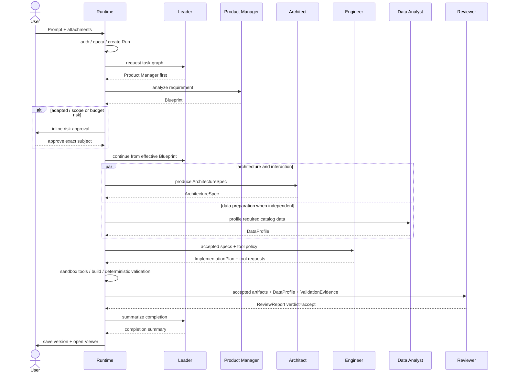

# Another Atom V2 任务编排与多 Agent 协作

[toc]

- 文档状态：V2 计划实施的 Agent 设计稿；按 V1 验收完成后进入实现
- 更新日期：2026-07-11
- V2 产品范围：[V2 产品范围与交互](../产品设计/01-产品范围与交互.md)
- V2 工程设计：[V2 多 Agent 执行与沙箱架构](./02-[工程]-多Agent执行与沙箱架构.md)
- V1 工程基线：[V1 系统架构](../../V1/技术设计/03-[工程]-系统架构.md)
- V1 Agent 基线：[V1 多 Agent 设计](../../V1/技术设计/01-[Agent]-多Agent设计.md)
- V1 产品范围：[V1 核心产品需求与交互](../../V1/产品设计/01-核心产品需求与交互.md)
- 参考分析：[Atoms 参考产品分析](../../整体/02-[参考]-Atoms参考产品分析.md)

## 背景

V1 固定团队只能按预定顺序完成一次构建，Lead 不能根据任务动态拆解、选择角色、并行推进或组织证据驱动的返工。本文定义 V2 的任务编排、角色协作和收敛语义。

## 摘要

- **协作模型**
  - V2 延续一个 Lead 和五个专业 Agent，以结构化 TaskGraph、Artifact、Handoff、ToolRequest 和 Evidence 组织动态协作。
- **任务推进**
  - Lead 提交任务拆解和依赖关系，Runtime 校验后调度角色子集、局部并行和阶段 Handoff。
- **返工与收敛**
  - Reviewer 和确定性 Evidence 可以触发有预算的回退、修订和仲裁，重复失败必须进入确定终态。
- **Tool 边界**
  - Agent 只能提交 ToolRequest，不能自行扩大权限、预算、轮次或直接访问宿主资源。
- **Runtime 控制**
  - Runtime 对状态推进、用户审批、工具授权和最终收敛拥有控制权，Agent 不执行发布。

## 1. 设计结论

V1 和 V2 使用相同的核心产物与可观测模型，但编排方式不同：

```text
V1: Fixed Sequential Role Pipeline
Lead Agent -> direct | Product Manager -> Architect -> Engineer -> Data Analyst -> Validator -> Reviewer
Lead 只做二选一路由；team 内固定顺序，不动态委派、不并行、不协商

V2: Autonomous Multi-Agent System
Team Leader -> Product Manager / Architect / Engineer / Data Analyst / Reviewer
动态委派、局部并行、结构化回退、仲裁与收敛
```

V2 延续 **1 个 Lead + 5 个专业 Agent**。变化不是“新增 Lead”，而是把 V1 仅能 `direct/team` 二选一的 Lead 升级为 TaskGraph 协调者。Architect 负责技术结构、数据契约、视觉 token 和交互边界；Engineer 负责实现与代码级测试；Data Analyst 负责数据处理和状态分析；Reviewer 负责基于完整 Contract 与 Evidence 的独立复核。不设置职责重复的 Designer 或 QA 别名。

V2 的“自主”有严格边界：Agent 可以提出分派、回退和修订建议，但用户审批、身份归属、配额事务、工具权限、轮次上限和 Publish 仍由平台 Runtime 强制执行。

### 1.1 V2 执行范式

V2 不是一个覆盖全系统的开放式 ReAct Loop，而是两层执行：

```text
Leader Agent
  -> Hierarchical Plan-and-Execute
  -> 输出 TaskGraph / LeaderDecision
            |
            v
Orchestrator Runtime
  -> 校验权限、预算、依赖、并发和 HITL
            |
            v
Specialist Agent
  -> 无 Tool 的结构化任务
  或 bounded ReAct: ToolRequest -> Observation -> 下一步
            |
            v
Artifact / Evidence -> Handoff -> Validator
```

- Leader 负责规划和调度建议，但不直接执行 Tool。
- Product Manager、Architect 默认仍以结构化 Contract 输出为主。
- Engineer、Data Analyst、Reviewer 只有在任务需要文件、测试或浏览器证据时，才进入有预算、有轮次上限的 bounded ReAct。
- Runtime 而不是 Agent 决定 ToolRequest 是否执行，并把结果作为 Observation 返回。
- Publish、范围变更和越权操作始终需要平台规则或用户确认。

## 2. V1 到 V2 的 Agent 改动总览

| 维度 | V1 | V2 改动 |
| --- | --- | --- |
| 执行范式 | Contract-first 固定 Plan -> Execute -> Validate | Leader 分层 Plan-and-Execute；Engineer/Data Analyst 可在单任务内 bounded ReAct |
| Agent 拓扑 | 独立 Lead Agent 二选一路由；team 内五个 Specialist 固定顺序 | Lead 升级为 TaskGraph 协调者；五个 Specialist 可按图执行 |
| Orchestrator | 平台状态机决定固定下一阶段 | Leader 提交 TaskGraph/Decision，Runtime 校验后动态调度 |
| Context | Runtime 为每阶段组装最小 Artifact Context | Agent 独立 Context，通过 Handoff Package 传递 Artifact/Evidence，不共享隐藏记忆 |
| Human-in-the-loop | adapted/范围变化、额外预算、破坏性仓库操作和 Publish | 保留 V1 风险门禁；新增越权 Tool、外部依赖/网络、预算扩展和无法仲裁冲突的确认 |
| Tool | Agent 默认无可执行 Tool | Specialist 提交结构化 ToolRequest；Runtime 按角色策略执行并返回 Observation |
| Sandbox | Linux Sandbox Host 上的 Project worktree、固定 Vim 和固定构建 | Engineer Task 使用独立可写快照；Data Analyst 使用对应快照的只读副本，Provider 可演进 |
| 并行 | 无 | Runtime 只对 TaskGraph 中无依赖且资源允许的节点开启局部并行 |
| 修复 | Validator 门禁 + 最多 1 轮 Engineer 自动修复 | Evidence 驱动的多角色 Rework，受 Artifact/调用/token/deadline 总预算约束 |
| 验收 | Validator 决定 mandatory pass/fail，Reviewer 独立复核 | 保留确定性门禁；Reviewer 增加证据驱动的拒收与根因请求，但不能覆盖 Evidence |
| 配额 | 顺序调用，逐次预占与结算 | 父 RunBudget + 子任务预占；并行任务必须原子聚合，取消后释放未使用额度 |
| 可观测性 | `stage.*` 和 StageRun | 增加 `agent.*`、`handoff.*`、`tool.*`、`arbitration.*`、`rework.*` |
| 数据模型 | Artifact、Approval、StageRun | 增加 TaskGraph、AgentInstance、Handoff、ToolRequest、Arbitration、RunBudget |
| 发布 | 用户显式 Publish | 保持不变，Leader 和 Specialist 都不能自动发布 |

### 2.1 角色映射

| V1 | V2 | 变化 |
| --- | --- | --- |
| Lead Agent + Sequential Orchestrator | Lead TaskGraph Agent + Orchestrator Runtime | Runtime 继续执行硬规则；Lead 从二选一路由升级为规划与仲裁建议 |
| Product Manager Agent | Product Manager Agent | 保留需求结构化职责，并扩展澄清和范围管理 |
| Architect Agent | Architect Agent | 扩展技术结构、数据契约、视觉 token、交互与可行性判断 |
| Engineer Agent | Engineer Agent | 从结构化 AppSpec 生成扩展到沙箱内实现与修复 |
| Data Analyst Agent | Data Analyst Agent | 从固定数据分析扩展为按任务执行的数据准备、分析与 DataProfile |
| Runtime Validator + Reviewer Agent | Runtime Validator + Reviewer Agent | 保留确定性门禁，Reviewer 按任务复核并提交 ReviewReport/ReworkRequest |

V1 与 V2 共用角色名称和 Artifact Contract；V2 改变的是上下文隔离、动态分派、工具权限和回退能力。

## 3. 控制权分层

V2 必须区分用户权力、平台硬控制、Leader 推理和专业角色判断。

| 控制层 | 可以决定 | 不能决定 |
| --- | --- | --- |
| User | adapted/范围变更确认、破坏性操作、Publish/Update | 不直接篡改运行状态和配额账本 |
| Orchestrator Runtime | 身份归属、配额、权限、超时、并发、轮次上限、状态迁移、工具执行 | 不替专业 Agent 生成产品或技术产物 |
| Leader Agent | 任务图建议、角色分派、局部并行、回退目标建议、冲突仲裁建议 | 不绕过 Runtime，不代用户确认，不直接执行 Shell，不自动发布 |
| Specialist Agent | 在自身 Contract 内做专业判断并提交产物或拒收 | 不直接调用其他 Agent，不扩大范围，不修改平台策略 |

Runtime 是最终执行者。Leader 的每个决定先形成结构化 `LeaderDecision`，再由 Runtime 校验用户审批、预算、权限、状态机和收敛策略。

## 4. 角色总览

| 角色 | 核心问题 | 输入 | 输出 |
| --- | --- | --- | --- |
| Leader | 谁在何时处理什么，冲突如何收敛 | 用户目标、Artifacts、运行状态、预算摘要 | `TaskGraph`、`LeaderDecision`、`ArbitrationDecision` |
| Product Manager | 用户到底要什么，是否在支持范围 | Prompt、附件元数据、用户反馈 | `Blueprint`、`ClarificationRequest` |
| Architect | 产品如何实现和呈现 | 已确认 Blueprint、平台能力、品牌输入 | `ArchitectureSpec`、`FeasibilityReport`、`InteractionSpec` |
| Engineer | 如何在许可边界内实现并验证 | ArchitectureSpec、工具策略 | `ImplementationPlan`、Tool Requests、`BuildArtifact`、工程测试证据 |
| Data Analyst | 数据、内容和状态是否完整 | Blueprint/AppSpec、只读快照、数据 ToolResult | `DataProfile`、数据 Evidence |
| Reviewer | 当前交付是否满足需求、工程和数据证据 | 已接受的 Specs、BuildArtifact、DataProfile、ValidationEvidence | `ReviewReport`、`ReworkRequest` |

## 5. Leader Agent

### 5.1 职责

- 基于用户目标和当前 Artifact 建议任务图。
- 在 Runtime 允许的范围内选择顺序或局部并行。
- 检查角色交付是否满足 Handoff Contract。
- 根据结构化证据建议回退目标。
- 对 Artifact 冲突给出可审计仲裁建议。
- 汇总用户可见进度、失败原因和待确认事项。

### 5.2 不属于 Leader 的职责

- 不直接预占、结算或释放配额；这些由 Runtime 的事务服务执行。
- 不执行文件、Shell、Build 或 Publish Tool。
- 不替 Product Manager、Architect、Engineer、Data Analyst、Reviewer 生成专业产物。
- 不代用户确认 adapted/范围变更、Restore、Unpublish 或 Publish。
- 不修改回退轮次、预算、超时和权限策略。

### 5.3 无需用户介入的建议

Leader 可以建议：

- 通过已满足 Contract 的阶段。
- 在策略上限内重试可重试失败。
- 将结构化 ReworkRequest 路由给责任角色。
- 在数据分析不依赖最终 ArchitectureSpec 时，并行执行 Architect 与 Data Analyst 的数据准备任务。
- 达到收敛策略后建议失败结束。

Runtime 校验建议后执行；“Leader 建议”不等于绕过策略直接写状态。

### 5.4 必须请求用户确认

- Blueprint 为 adapted，或执行范围相对用户已知目标发生变化。
- 超出已确认 Blueprint 的范围变更。
- 从受控模板升级到新技术栈或新增外部依赖。
- ToolRequest 需要超出角色默认权限、依赖白名单或网络 allowlist。
- Run 已达到调用、token 或 deadline 预算，需要追加预算后继续。
- Leader 无法在现有 Contract 内仲裁、且选择会改变用户已确认目标。
- 删除、Restore、Unpublish 等破坏性操作。
- Publish 和 Update。

## 6. 专业角色契约

### 6.1 Product Manager Agent

输入：Prompt、附件元数据、模式、当前 Clarification。

输出：`Blueprint`。

```json
{
  "schema_version": "2.0",
  "project_name": "Mono Market",
  "product_type": "product_catalog",
  "support_level": "supported",
  "pages": ["Home", "Catalog", "Product"],
  "modules": ["catalog", "product_detail", "seo"],
  "constraints": [],
  "acceptance_goals": []
}
```

边界：可以澄清和归类，不能擅自扩大产品范围；`adapted` 或 `unsupported` 必须将映射与缺失信息交给用户。

### 6.2 Architect Agent

输入：用户已确认的 Blueprint、平台能力、技术约束、品牌与附件信息。

输出：`ArchitectureSpec`、`FeasibilityReport` 与 `InteractionSpec`。

```json
{
  "schema_version": "2.0",
  "routes": [{ "path": "/", "page": "Home" }],
  "modules": [{ "id": "catalog", "contract": "ProductList" }],
  "data_contracts": [{ "entity": "product", "source": "platform.products" }],
  "theme": "editorial",
  "tokens": {
    "primary_color": "#111111",
    "surface_color": "#ffffff"
  },
  "responsive_rules": [],
  "interaction_states": [],
  "runtime_constraints": {
    "allowed_dependencies": [],
    "requires_network": false
  }
}
```

边界：负责技术结构、数据、视觉、响应式、交互和可行性，但不得删除 Blueprint 已确认范围或擅自扩大技术栈。发现需求冲突时提交 `ReworkRequest(root_cause=requirements)`。

### 6.3 Engineer Agent

输入：ArchitectureSpec、InteractionSpec、平台 Tool Policy。

输出：`ImplementationPlan` 和结构化 Tool Requests；Runtime 执行 Tool 后形成 `BuildArtifact`。

Engineer 不直接获得宿主机 Shell。V2 只有在独立沙箱和 Tool Policy 生效后，才能申请文件、依赖、构建和测试操作。

```json
{
  "schema_version": "2.0",
  "changes": [
    {
      "path": "src/pages/Home.tsx",
      "operation": "update",
      "artifact_refs": ["architecture:v3", "visual:v2"]
    }
  ],
  "tool_requests": ["workspace.apply_patch", "build.run"]
}
```

边界：可以决定实现细节和局部重构；新增依赖、改变 ArchitectureSpec 或扩大网络权限必须请求 Leader，由 Runtime 或用户审批。

### 6.4 Data Analyst Agent

输入：Blueprint、AppSpec、BuildArtifact、ArchitectureSpec、InteractionSpec 和只读数据 ToolResult。

输出：`DataProfile` 与数据 Evidence。

```json
{
  "schema_version": "2.0",
  "summary": "The application uses local task state and contains one incomplete sample record.",
  "checks": [
    {
      "item": "local-state",
      "status": "warning",
      "evidence_ref": "data:local-state"
    }
  ]
}
```

Data Analyst Agent 可以执行结构化数据处理、分析数据完整性并提交可引用 Evidence；不能修改 Specs，不解释工程校验，也不决定发布门。

### 6.5 Reviewer Agent

输入：已接受的 Blueprint、ArchitectureSpec、InteractionSpec、Implementation Artifact、DataProfile、Build/Test/Validation Evidence。

输出：`ReviewReport` 或 `ReworkRequest`。

```json
{
  "schema_version": "2.0",
  "verdict": "rework",
  "issues": [
    {
      "severity": "blocker",
      "root_cause": "implementation",
      "target": "primary-interaction",
      "evidence_ref": "validation:primary-interaction"
    }
  ]
}
```

Reviewer 负责把需求、数据事实和确定性工程 Evidence 放在一起复核，并按根因提交返工建议；不能修改 Specs、源码或 Validator 结果，也不能自动发布。

## 7. 发布门与 Reviewer 结论

V2 不使用未经校准的单一数字分数作为发布门。

通过条件：

- 所有 mandatory deterministic checks 通过。
- blocker/error 级问题为 0。
- Specs 定义的核心路由与交互有对应 evidence。
- ReviewReport verdict 为 accept，且没有未处理的 blocker 或范围冲突。

数值 score 可以作为排序和趋势指标，但只有在建立测试集并完成校准后才能设置阈值。当前不预设 `>=85` 等缺少依据的数字。

## 8. Handoff Contract

所有 Agent 交接都通过 Runtime 持久化，不进行不可审计的点对点私聊。

```json
{
  "schema_version": "2.0",
  "message_id": "msg_123",
  "run_id": "run_123",
  "correlation_id": "task_123",
  "from": "architect",
  "to": "engineer",
  "type": "deliver",
  "artifact_ref": "architecture:v3",
  "evidence_refs": [],
  "round": 1,
  "created_at": "2026-07-11T00:00:00Z"
}
```

规则：

- Artifact 不可原地覆盖；修订创建新版本。
- 下游必须明确 accept 或 reject，不能以自由文本隐式接收。
- reject 必须包含 `root_cause`、`reason` 和 evidence refs。
- Runtime 校验 from/to、权限、Artifact 版本、round 和预算。
- 所有 Handoff 必须可重放、可审计和幂等处理。

## 9. 正常协作流程

Blueprint 通过 Contract 且 Risk Policy 允许继续后，Architect 可以与 Data Analyst 的数据准备任务局部并行；Engineer 必须等待 ArchitectureSpec 和所需 DataProfile 都通过 Contract。



Publish 不在协作链路中自动发生。用户选择版本并显式触发 Publish，Runtime 独立执行发布状态机。

## 10. 回退与根因路由

Agent 不能直接调用另一个 Agent。所有 reject 和 rework 都提交给 Leader，再由 Runtime 校验和执行。

Leader 不强制沿线性链路逐级回退；当 evidence 足够时，应直接路由给最近责任角色，减少无意义转发：

| root_cause | 目标 |
| --- | --- |
| `implementation` | Engineer |
| `architecture` 或 `data_contract` | Architect |
| `visual` 或 `interaction` | Architect |
| `requirements` 或 `scope` | Product Manager，必要时请求用户 |
| `platform` | Runtime 失败处理，不交给 Agent 修复 |

```json
{
  "type": "reject",
  "from": "reviewer",
  "root_cause": "implementation",
  "reason": "Product CTA does not navigate",
  "evidence_refs": ["validation:product-cta"],
  "suggested_fix": "Check route binding"
}
```

如果 Reviewer 只能怀疑根因，标记 `root_cause=unknown`，由 Leader 基于 Artifacts 建议目标；Runtime 不允许 Reviewer 绕过 Leader 直接触发 Engineer 或 Architect。

## 11. 仲裁

角色冲突统一提交 `ArbitrationRequest`。Leader 依据以下优先级给出建议：

```text
用户已确认的 Blueprint
    > Runtime 安全与能力策略
    > 已接受的上游 Artifact Contract
    > 下游带证据的可行性反馈
    > 无证据的角色偏好
```

仲裁结果只有三类：

1. 接受回退并分派责任角色。
2. 驳回回退，要求当前角色在 Contract 内解决。
3. 涉及范围或用户意图变化，暂停并请求用户。

每次仲裁写入 `arbitration.*` 事件，包含引用的 Artifact、Evidence、建议理由和 Runtime 最终执行结果。前端展示结论和证据入口，不展示模型私有推理。

## 12. 收敛策略

轮次和预算上限属于 Runtime Policy，不由 Leader Agent 自行修改。

```text
max_total_rework_rounds
max_revisions_per_artifact
max_same_evidence_repeats
max_agent_calls
max_token_budget
run_deadline
```

原始建议中的 Data Analyst/Engineer 3 轮、Engineer/Architect 2 轮、总计 6 轮可以作为压测起点，但当前没有 V2 运行数据支持把它们写成最终产品承诺。

收敛条件：

1. Mandatory checks 全部通过且无 blocker/error，正常完成。
2. 某 Artifact 达到修订上限，升级到 Leader 仲裁或用户确认。
3. 连续两轮 evidence 和 Artifact diff 没有实质变化，提前失败止损。
4. 达到总轮次、调用数、token 预算或 deadline，失败结束。
5. 失败结束保留最近可用 Version，释放未使用配额并返回可操作错误。

### 12.1 并行分支的 Agent 行为

- 一支成功、一支失败时，Leader 不能建议回滚已发生的 Provider 用量，也不能删除成功 Artifact 来伪装原子失败。
- 成功 Artifact 保持 Accepted/PendingMerge；失败分支生成新的 attempt 或 ReworkRequest。
- 除非上游 Contract 已改变，Runtime 不允许 Leader 重跑已经成功且 hash 未变化的分支。
- Leader 可以建议：重试失败分支、取消未启动依赖、重排 TaskGraph、使用成功 Artifact 继续，或请求用户追加预算/修改范围。
- 预算预占、结算、释放和部分失败补偿由 Runtime 执行，具体事务语义以 [V2 多 Agent 执行与沙箱架构：并行配额与部分失败](./02-[工程]-多Agent执行与沙箱架构.md#5-并行配额与部分失败)为准。

Atoms 官方建议连续 2-3 轮无法修复时通过 Remix 减少旧上下文干扰，这可以支持“必须止损”的方向，但不能直接证明 V2 各回退边的具体轮次上限。

## 13. Context、Tool 与 Sandbox

### 13.1 独立 Context 与 Handoff

每个 Agent 拥有独立上下文，只接收完成当前任务所需的 Artifact 和 Evidence 摘要。

```text
Agent Context
  = role instruction + prompt version
  + assigned Task
  + accepted input Artifact versions
  + Evidence summary
  + Tool observations owned by this Task
  + remaining task/run budget
```

- Agent 之间不共享原始消息历史或私有 Chain of Thought。
- Handoff 必须引用不可变 Artifact/Evidence ID、schema version 和 content hash。
- Leader 只接收任务状态、Artifact 摘要、冲突和预算，不默认读取 Specialist 的完整上下文。
- Rework 创建新的 Artifact version，不原地覆盖上轮产物。
- Context 超过预算时优先保留用户确认 Contract、当前任务、最近 Evidence 和未解决 blocker；旧过程压缩为结构化摘要。

### 13.2 Tool Policy

| Agent | 默认工具权限 |
| --- | --- |
| Leader | 无业务工具；只提交结构化调度与仲裁建议 |
| Product Manager | 无 Shell/文件工具；可读取用户输入和 Blueprint 历史 |
| Architect | 只读平台能力、Contract 与品牌资产元数据；无写文件或执行权限 |
| Engineer | 通过 Runtime 申请 `list_files`、`read_file`、`apply_patch`、`run_build`、`run_tests`、`request_dependency` |
| Data Analyst | 只读 `inspect_artifact`、`run_tests`、`browser_check`、`capture_screenshot` |
| Reviewer | 只读 `inspect_artifact`、`browser_check`、`capture_screenshot`；不能申请写操作 |

Runtime 在每次 Tool Request 前检查 Agent 身份、Project 归属、参数 schema、预算、网络策略和沙箱边界。

ToolRequest 至少包含：

```text
tool_request_id
run_id / task_id / agent_instance_id
tool_name
arguments
artifact_base_version
requested_capabilities
expected_output_type
idempotency_key
```

ToolResult 至少包含状态、stdout/stderr 摘要、Evidence/Artifact 引用、资源用量和错误码。Agent 只能看到当前 Task 的 ToolResult，不能直接读取宿主机或其他任务结果。

`request_dependency` 不是直接执行 `npm install`：Runtime 先校验依赖白名单、版本、网络策略和用户审批要求，再在隔离环境中执行。V2 默认仍不提供 unrestricted shell。

### 13.3 Run 级隔离 Sandbox

V2 只有在下列隔离条件满足后，才能开放 Engineer 文件/构建 Tool：

- 每个 Engineer Task 从不可变 Artifact/Base Image 创建独立可写快照。
- 多个 Agent 不共享可写工作区；Handoff 通过 Patch/Artifact 合并，不通过同目录并发写入。
- Data Analyst 和 Reviewer 获取待验收快照的只读副本，不能修改 Engineer 产物。
- 默认禁止出网；确需访问的域名和依赖通过 allowlist 与审批开放。
- Secret 由 Runtime 按 Tool 临时注入，不进入 Agent Context、文件或日志。
- CPU、内存、磁盘、进程数、执行时间和输出大小都有硬限制。
- Tool 完成后保存 Patch、BuildArtifact、Evidence 和资源用量；Sandbox 随 Task 完成或失败销毁。
- 产物合入主 ProjectVersion 前必须通过构建、测试、安全和 mandatory validation。

具体采用容器、MicroVM 或远程 Sandbox 服务仍需在 V2 技术设计中确认，但上述隔离语义是实现前置条件，不能继续复用 V1 共享容器并逐项放宽权限。

## 14. 状态、事件与数据模型

V2 保留 V1 的 `stage.*` 事件用于前端兼容，并新增：

```text
agent.started
agent.completed
agent.failed
handoff.created
handoff.accepted
handoff.rejected
arbitration.requested
arbitration.decided
rework.started
rework.completed
```

建议新增或扩展：

- `task_graphs` / `agent_tasks`：任务依赖、状态、分派、并发组和 deadline。
- `agent_instances`：角色、模型、Prompt 版本、工具策略。
- `agent_stage_runs`：独立 Agent 调用、输入/输出 Artifact、用量、尝试次数。
- `artifacts`：沿用 V1 不可变 Artifact，增加 Task/Handoff/merge correlation。
- `handoffs`：交付、接受、拒绝和 correlation ID。
- `tool_requests` / `tool_results`：Tool 参数、权限决定、Observation、Evidence 和资源用量。
- `sandbox_runs`：隔离环境、基础快照、资源限制、网络策略、状态和销毁时间。
- `arbitrations`：冲突、证据、Leader 建议和 Runtime 决定。
- `run_budgets`：父 Run 的调用、token、时间和并发预算。

V2 不应只给现有 Event 增加一个 `agent_id`；回退、仲裁、Artifact 版本和预算都需要独立可查询状态。

## 15. 界面呈现

### 15.1 V1

- 默认展示 Lead 单一对话入口；Lead 判断为 team 后可展开“固定团队 · 分阶段接力 / Sequential team pipeline”。
- 同一时刻只高亮一个角色。
- 每个角色展示 Blueprint、ArchitectureSpec、AppSpec、DataProfile、ValidationReport、ReviewReport 入口。
- 不显示并行、自主协商或 Agent 私有推理。

### 15.2 V2

- 显示当前任务图、活跃 Agent、并行分支和 Handoff 状态。
- Leader 在规划、仲裁、请求用户和完成汇总时显示为 Coordinator；沿用 V1 Lead 的同一对话身份。
- 回退在原时间线上标记 Rework，不创建一条无法关联的新流程。
- 每条拒绝和仲裁显示 Artifact/Evidence 链接。
- 不展示 Chain of Thought，只展示结构化决策、结果和证据。

## 16. V1 到 V2 的升级步骤

1. 冻结并版本化 V1 Blueprint、ArchitectureSpec、AppSpec、DataProfile、ValidationReport、ReviewReport Contract。
2. 将 V1 Sequential Orchestrator 抽象为可持久化 TaskGraph Runtime。
3. 扩展 Artifact，并增加 TaskGraph、Handoff、ToolRequest、SandboxRun、Arbitration 和 RunBudget。
4. 扩展 Architect 的技术、数据、视觉与交互 Contract，并把 AppSpec 实现细节下沉到 ImplementationPlan。
5. 为 Engineer、Data Analyst 和 Reviewer 建立独立沙箱与只读/写入 Tool Policy。
6. 先上线多 Agent 顺序 Handoff，再对无依赖的 Architect/Data Analyst 数据准备开启局部并行。
7. 完成并发配额预占、取消、部分失败和恢复测试后，才开放动态任务图。

V2 不通过直接替换 `orchestrator.py` 获得；Runtime、数据模型、预算和工具隔离都必须先升级。

## 17. 已决事项与未决事项

### 17.1 本文已决

- V1 Lead 是真实 Agent，只做 `direct/team` 二选一路由；V2 将其升级为 TaskGraph 规划和仲裁建议者。
- V2 采用 Lead、Product Manager、Architect、Engineer、Data Analyst、Reviewer，形成 1 Lead + 5 Specialist Agents。
- Reviewer 发布门以 deterministic mandatory checks 和 blocker/error 为准，不预设无依据数字阈值。
- Agent 只提出调度、工具和回退请求；Runtime 执行所有硬控制。
- Publish 始终由用户显式触发。

### 17.2 V2 开发前待确认

- 具体模型供应商、Agent SDK 和 Prompt 版本策略。
- V2 是否与 CC 式 Local Runtime 同版本交付。
- 远程沙箱实现、网络策略和依赖白名单。
- Data Analyst 是否加入页面数据可视化截图分析，以及 Reviewer 对应测试集如何构建。
- 各回退边、总预算和 deadline 的压测结果。
- V2 P0 首批新增哪些非 Web Source/Build/Runtime Adapter，以及各自需要哪些专用 Contract、Tool 和 Evidence。
- Web、Agent Worker、Object Storage 和 Sandbox Provider 的实际部署成本。

## 18. V2 Agent 演进取舍摘要

本节承接原 README 中的 V2 Agent 版本说明；具体 Contract、状态和验收仍以前文为准。

- **[动态 TaskGraph]** Lead 提交任务、依赖、角色、并行组和预算建议；Runtime 拒绝环、未知角色和越权计划。
- **[角色子集]** Product Manager、Architect、Engineer、Data Analyst、Reviewer 按实际任务参与，不再要求每个请求机械运行完整团队；没有数据任务时可以不调度 Data Analyst，但交付前仍必须经过确定性校验与 Reviewer。
- **[独立 Context]** 每个 Agent 只接收当前 Task 所需 Artifact、Evidence、Tool Observation 和预算摘要，通过 Handoff Package 交接，不共享隐藏记忆或 Chain of Thought。
- **[选择性并行]** Runtime 只并行无依赖冲突、无共享写入且已原子预留预算的节点，不把“多 Agent”直接等同于并行。
- **[结构化返工]** Handoff 可以基于 Contract 和 Evidence 拒收；Lead 可建议返工和仲裁，Runtime 控制预算、次数与状态收敛。
- **[受控 Tool]** Agent 只提交 ToolRequest；Tool Gateway 校验角色、参数、路径、网络、预算和 Sandbox 后返回可审计 ToolResult。
- **[核心取舍]** V2 的自主性来自可验证 TaskGraph、Handoff 和 Tool，而不是放宽 Runtime 权限；并行收益必须由真实成功率、耗时和成本数据证明。
