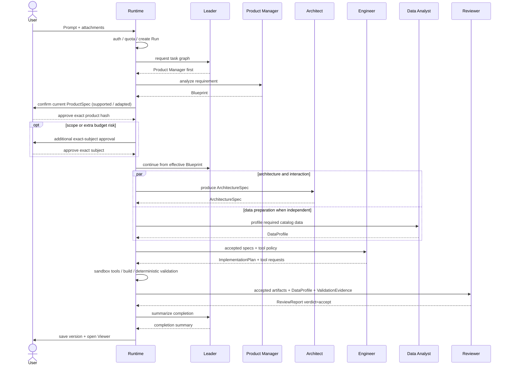

# 任务图与协作设计草案

[toc]

- 适用范围：任务图与多角色协作；草案
- 整理日期：2026-09-29；原文基线：b3da451
- 文档状态：保留既有技术草案，已同步 PQ-03 的按需计划确认约束；不代表技术确认、实现或验证完成
- Feature 入口：[README](./README.md)
- 原文追溯：b3da451 中的 docs/design/V2/技术设计/01-[Agent]-任务编排与多Agent协作.md

## 背景

承接既有任务图、Handoff、预算与收敛方案；保留原草案状态，不因迁移获得技术确认。

## 摘要

- 详细规则在本 Feature 内持续维护，其他文档通过链接引用；章节保留原编号便于迁移核对。
- 已确认设计、代码现状与实际环境验证分别记录；迁移不把旧目标当成已实现能力。

<a id="va-1-设计结论"></a>

## 1. 设计结论

既有固定流程和任务图协作方案使用相同的核心产物与可观测模型，但编排方式不同：

```text
既有固定流程: Fixed Sequential Role Pipeline
Lead -> direct / clarify / PM -> 产品确认 -> Architect -> Engineer -> Runtime Build/Test/Validator
Lead 处理回答、澄清和团队路由；首次固定三角色，修改的固定入口另见 Feature 04；不动态任务图、不并行

任务图协作方案: Autonomous Multi-Agent System
Team Leader -> Product Manager / Architect / Engineer / Data Analyst / Reviewer
动态委派、局部并行、结构化回退、仲裁与收敛
```

任务协作草案提出 **1 个 Lead + 5 个专业 Agent**，其中 Data Analyst 与 Reviewer 不在当前固定流程的新运行中启用。变化不是“新增 Lead”，而是把既有流程中负责回答／澄清与固定团队路由的 Lead 扩展为 TaskGraph 协调者。Architect 负责技术结构、数据契约、视觉 token 和交互边界；Engineer 负责实现与代码级测试；Data Analyst 负责数据处理和状态分析；Reviewer 负责基于完整 Contract 与 Evidence 的独立复核。不设置职责重复的 Designer 或 QA 别名。

任务图协作方案的“自主”有严格边界：Agent 可以提出分派、回退和修订建议，但用户审批、身份归属、配额事务、工具权限、轮次上限和 Publish 仍由平台 Runtime 强制执行。

<a id="va-11-v2-执行范式"></a>

## 1.1 执行范式

任务图协作方案不是一个覆盖全系统的开放式 ReAct Loop，而是两层执行：

```text
Leader Agent
  -> Hierarchical Plan-and-Execute
  -> 输出 TaskGraph / LeaderDecision
            |
            v
Orchestrator Runtime
  -> 校验权限、预算、依赖、并发和 HITL
            |
            v
Specialist Agent
  -> 无 Tool 的结构化任务
  或 bounded ReAct: ToolRequest -> Observation -> 下一步
            |
            v
Artifact / Evidence -> Handoff -> Validator
```

- Leader 负责规划和调度建议，但不直接执行 Tool。
- Product Manager、Architect 默认仍以结构化 Contract 输出为主。
- Engineer、Data Analyst、Reviewer 只有在任务需要文件、测试或浏览器证据时，才进入有预算、有轮次上限的 bounded ReAct。
- Runtime 而不是 Agent 决定 ToolRequest 是否执行，并把结果作为 Observation 返回。
- Publish、范围变更和越权操作始终需要平台规则或用户确认。

<a id="va-2-v1-到-v2-的-agent-改动总览"></a>

## 2. 从固定流程到任务图协作的改动

| 维度 | 既有固定流程 | 任务图协作方案改动 |
| --- | --- | --- |
| 执行范式 | Contract-first 固定 Plan -> Execute -> Validate | Leader 分层 Plan-and-Execute；Engineer/Data Analyst 可在单任务内 bounded ReAct |
| Agent 拓扑 | 首次创建完整三角色链路；已有项目修改的三个固定入口已纳入产品基线、尚未实现，见 [Feature 04](../04-对话式代码修改/01-产品说明.md#5-lead-与下游团队如何分工) | Lead 升级为 TaskGraph 协调者；五个 Specialist 可按图执行 |
| Orchestrator | 平台状态机决定固定下一阶段 | Leader 提交 TaskGraph/Decision，Runtime 校验后动态调度 |
| Context | Runtime 为每阶段组装最小 Artifact Context | Agent 独立 Context，通过 Handoff Package 传递 Artifact/Evidence，不共享隐藏记忆 |
| Human-in-the-loop | supported/adapted ProductSpec 固定确认；另有范围变化、额外预算、破坏性操作及发布确认 | 保留既有固定流程风险门禁；新增越权 Tool、外部依赖/网络、预算扩展和无法仲裁冲突的确认 |
| Tool | Agent 默认无可执行 Tool | Specialist 提交结构化 ToolRequest；Runtime 按角色策略执行并返回 Observation |
| Sandbox | 独立编辑宿主机负责受限 Vim；共享执行服务负责固定 Build/Test，只有服务级隔离 | Engineer Task 使用独立可写快照；Data Analyst 使用对应快照的只读副本，Provider 可演进 |
| 并行 | 无 | Runtime 只对 TaskGraph 中无依赖且资源允许的节点开启局部并行 |
| 修复 | Validator 门禁 + 最多 1 轮 Engineer 自动修复 | Evidence 驱动的多角色 Rework，受 Artifact/调用/token/deadline 总预算约束 |
| 验收 | Runtime Validator 决定 mandatory pass/fail，固定流程的新运行不调用 Reviewer | 保留确定性门禁；Reviewer 增加证据驱动的拒收与根因请求，但不能覆盖 Evidence |
| 配额 | 顺序调用，逐次预占与结算 | 父 RunBudget + 子任务预占；并行任务必须原子聚合，取消后释放未使用额度 |
| 可观测性 | `stage.*` 和 StageRun | 增加 `agent.*`、`handoff.*`、`tool.*`、`arbitration.*`、`rework.*` |
| 数据模型 | Artifact、Approval、StageRun | 增加 TaskGraph、AgentInstance、Handoff、ToolRequest、Arbitration、RunBudget |
| 发布 | 用户显式 Publish | 保持不变，Leader 和 Specialist 都不能自动发布 |

<a id="va-21-角色映射"></a>

## 2.1 角色映射

固定流程的新运行使用 Lead、PM、Architect、Engineer 与确定性 Runtime Validator。任务协作草案保留这些职责并提出 TaskGraph、Data Analyst 与 Reviewer 的独立交付，不是沿用一个当前已存在的五专业角色流水线。详细角色草案见 [Feature 10](../../01-角色职责与能力/10-角色职责与交付物/03-任务协作角色职责草案.md)。

当前实现已使用完整 ProductSpec、ArchitectureDesign 和通用 SourceBundle，任务图协作方案旧 JSON 示例仍偏重 Blueprint/ArchitectureSpec；实施前须核对这些接口如何继承，不能直接把旧字段示例当成已确认迁移合同。

<a id="va-3-控制权分层"></a>

## 3. 控制权分层

任务图协作方案必须区分用户权力、平台硬控制、Leader 推理和专业角色判断。

| 控制层 | 可以决定 | 不能决定 |
| --- | --- | --- |
| User | adapted/范围变更确认、破坏性操作、Publish/Update | 不直接篡改运行状态和配额账本 |
| Orchestrator Runtime | 身份归属、配额、权限、超时、并发、轮次上限、状态迁移、工具执行 | 不替专业 Agent 生成产品或技术产物 |
| Leader Agent | 任务图建议、角色分派、局部并行、回退目标建议、冲突仲裁建议 | 不绕过 Runtime，不代用户确认，不直接执行 Shell，不自动发布 |
| Specialist Agent | 在自身 Contract 内做专业判断并提交产物或拒收 | 不直接调用其他 Agent，不扩大范围，不修改平台策略 |

Runtime 是最终执行者。Leader 的每个决定先形成结构化 `LeaderDecision`，再由 Runtime 校验用户审批、预算、权限、状态机和收敛策略。

按 [PQ-03](./产品澄清.md#pq-03)，AI 负责识别必要澄清或用户取舍，不要求每份 TaskGraph 固定等待用户确认；已确认范围内且校验通过时继续执行。范围、预算、权限及破坏性变化等已有确认规则仍由 Runtime 执行，AI 未请求确认不能成为放行依据。AI 判断的持久化、具体确认对象和恢复协议仍须在技术设计与 Code Spec 中明确，本次不将草案视为定稿。

<a id="va-7-发布门与-reviewer-结论"></a>

## 7. 发布门与 Reviewer 结论

任务图协作方案不使用未经校准的单一数字分数作为发布门。

通过条件：

- 所有 mandatory deterministic checks 通过。
- blocker/error 级问题为 0。
- Specs 定义的核心路由与交互有对应 evidence。
- ReviewReport verdict 为 accept，且没有未处理的 blocker 或范围冲突。

数值 score 可以作为排序和趋势指标，但只有在建立测试集并完成校准后才能设置阈值。当前不预设 `>=85` 等缺少依据的数字。

<a id="va-8-handoff-contract"></a>

## 8. Handoff Contract

所有 Agent 交接都通过 Runtime 持久化，不进行不可审计的点对点私聊。

```json
{
  "schema_version": "2.0",
  "message_id": "msg_123",
  "run_id": "run_123",
  "correlation_id": "task_123",
  "from": "architect",
  "to": "engineer",
  "type": "deliver",
  "artifact_ref": "architecture:v3",
  "evidence_refs": [],
  "round": 1,
  "created_at": "2026-07-11T00:00:00Z"
}
```

规则：

- Artifact 不可原地覆盖；修订创建新版本。
- 下游必须明确 accept 或 reject，不能以自由文本隐式接收。
- reject 必须包含 `root_cause`、`reason` 和 evidence refs。
- Runtime 校验 from/to、权限、Artifact 版本、round 和预算。
- 所有 Handoff 必须可重放、可审计和幂等处理。

<a id="va-9-正常协作流程"></a>

## 9. 正常协作流程

当前 ProductSpec 经用户确认、Blueprint 通过 Contract 且 Risk Policy 允许继续后，Architect 可以与 Data Analyst 的数据准备任务局部并行；Engineer 必须等待 ArchitectureSpec 和所需 DataProfile 都通过 Contract。



Publish 不在协作链路中自动发生。用户选择版本并显式触发 Publish，Runtime 独立执行发布状态机。

<a id="va-10-回退与根因路由"></a>

## 10. 回退与根因路由

Agent 不能直接调用另一个 Agent。所有 reject 和 rework 都提交给 Leader，再由 Runtime 校验和执行。

Leader 不强制沿线性链路逐级回退；当 evidence 足够时，应直接路由给最近责任角色，减少无意义转发：

| root_cause | 目标 |
| --- | --- |
| `implementation` | Engineer |
| `architecture` 或 `data_contract` | Architect |
| `visual` 或 `interaction` | Architect |
| `requirements` 或 `scope` | Product Manager，必要时请求用户 |
| `platform` | Runtime 失败处理，不交给 Agent 修复 |

```json
{
  "type": "reject",
  "from": "reviewer",
  "root_cause": "implementation",
  "reason": "Product CTA does not navigate",
  "evidence_refs": ["validation:product-cta"],
  "suggested_fix": "Check route binding"
}
```

如果 Reviewer 只能怀疑根因，标记 `root_cause=unknown`，由 Leader 基于 Artifacts 建议目标；Runtime 不允许 Reviewer 绕过 Leader 直接触发 Engineer 或 Architect。

<a id="va-11-仲裁"></a>

## 11. 仲裁

角色冲突统一提交 `ArbitrationRequest`。Leader 依据以下优先级给出建议：

```text
Runtime 安全与能力硬约束（不可被用户目标或 Agent 仲裁绕过）
    > 用户已确认的 ProductSpec / Blueprint
    > 已接受的上游 Artifact Contract
    > 下游带证据的可行性反馈
    > 无证据的角色偏好
```

仲裁结果只有三类：

1. 接受回退并分派责任角色。
2. 驳回回退，要求当前角色在 Contract 内解决。
3. 涉及范围或用户意图变化，暂停并请求用户。

每次仲裁写入 `arbitration.*` 事件，包含引用的 Artifact、Evidence、建议理由和 Runtime 最终执行结果。前端展示结论和证据入口，不展示模型私有推理。

<a id="va-12-收敛策略"></a>

## 12. 收敛策略

轮次和预算上限属于 Runtime Policy，不由 Leader Agent 自行修改。

```text
max_total_rework_rounds
max_revisions_per_artifact
max_same_evidence_repeats
max_agent_calls
max_token_budget
run_deadline
```

原始建议中的 Data Analyst/Engineer 3 轮、Engineer/Architect 2 轮、总计 6 轮可以作为压测起点，但当前没有任务图协作方案运行数据支持把它们写成最终产品承诺。

收敛条件：

1. Mandatory checks 全部通过且无 blocker/error，正常完成。
2. 某 Artifact 达到修订上限，升级到 Leader 仲裁或用户确认。
3. 连续两轮 evidence 和 Artifact diff 没有实质变化，提前失败止损。
4. 达到总轮次、调用数、token 预算或 deadline，失败结束。
5. 失败结束保留最近可用 Version，释放未使用配额并返回可操作错误。

<a id="va-121-并行分支的-agent-行为"></a>

## 12.1 并行分支的 Agent 行为

- 一支成功、一支失败时，Leader 不能建议回滚已发生的 Provider 用量，也不能删除成功 Artifact 来伪装原子失败。
- 成功 Artifact 保持 Accepted/PendingMerge；失败分支生成新的 attempt 或 ReworkRequest。
- 除非上游 Contract 已改变，Runtime 不允许 Leader 重跑已经成功且 hash 未变化的分支。
- Leader 可以建议：重试失败分支、取消未启动依赖、重排 TaskGraph、使用成功 Artifact 继续，或请求用户追加预算/修改范围。
- 预算预占、结算、释放和部分失败补偿由 Runtime 执行，具体事务语义以 [持久化调度：并行配额与部分失败](./03-持久化调度与协作状态.md#vs-5-并行配额与部分失败)为准。

Atoms 官方建议连续 2-3 轮无法修复时通过 Remix 减少旧上下文干扰，这可以支持“必须止损”的方向，但不能直接证明任务图协作方案各回退边的具体轮次上限。

<a id="va-13-contexttool-与-sandbox"></a>

## 13. Context、Tool 与 Sandbox

本组详细条款见 [02-任务图与协作设计](./02-任务图与协作设计.md)、[02-工具网关与任务沙箱设计](../../04-执行与验证环境/17-任务级隔离与受控工具/02-工具网关与任务沙箱设计.md)。

<a id="va-131-独立-context-与-handoff"></a>

## 13.1 独立 Context 与 Handoff

每个 Agent 拥有独立上下文，只接收完成当前任务所需的 Artifact 和 Evidence 摘要。

```text
Agent Context
  = role instruction + prompt version
  + assigned Task
  + accepted input Artifact versions
  + Evidence summary
  + Tool observations owned by this Task
  + remaining task/run budget
```

- Agent 之间不共享原始消息历史或私有 Chain of Thought。
- Handoff 必须引用不可变 Artifact/Evidence ID、schema version 和 content hash。
- Leader 只接收任务状态、Artifact 摘要、冲突和预算，不默认读取 Specialist 的完整上下文。
- Rework 创建新的 Artifact version，不原地覆盖上轮产物。
- Context 超过预算时优先保留用户确认 Contract、当前任务、最近 Evidence 和未解决 blocker；旧过程压缩为结构化摘要。

<a id="va-14-状态事件与数据模型"></a>

## 14. 状态、事件与数据模型

任务图协作方案保留既有 `stage.*` 事件用于前端兼容，并新增：

```text
agent.started
agent.completed
agent.failed
handoff.created
handoff.accepted
handoff.rejected
arbitration.requested
arbitration.decided
rework.started
rework.completed
```

建议新增或扩展：

- `task_graphs` / `agent_tasks`：任务依赖、状态、分派、并发组和 deadline。
- `agent_instances`：角色、模型、Prompt 版本、工具策略。
- `agent_stage_runs`：独立 Agent 调用、输入/输出 Artifact、用量、尝试次数。
- `artifacts`：沿用既有固定流程不可变 Artifact，增加 Task/Handoff/merge correlation。
- `handoffs`：交付、接受、拒绝和 correlation ID。
- `tool_requests` / `tool_results`：Tool 参数、权限决定、Observation、Evidence 和资源用量。
- `sandbox_runs`：隔离环境、基础快照、资源限制、网络策略、状态和销毁时间。
- `arbitrations`：冲突、证据、Leader 建议和 Runtime 决定。
- `run_budgets`：父 Run 的调用、token、时间和并发预算。

任务图协作方案不应只给现有 Event 增加一个 `agent_id`；回退、仲裁、Artifact 版本和预算都需要独立可查询状态。

<a id="va-15-界面呈现"></a>

## 15. 界面呈现

本组详细条款见 [02-任务图与协作设计](./02-任务图与协作设计.md)。

<a id="va-151-v1"></a>

## 15.1 既有固定流程

既有固定流程展示 Lead 单一对话入口和真实的固定角色接力，同一主流程不伪装并行。新运行角色为 PM、Architect、Engineer，显示有效产品、架构、源码与确定性运行结果；DataProfile／ReviewReport 仅对历史记录只读兼容。已有项目固定入口的产品目标及实现状态见 Feature 04。

<a id="va-152-v2"></a>

## 15.2 任务图协作方案

- 显示当前任务图、活跃 Agent、并行分支和 Handoff 状态。
- Leader 在规划、仲裁、请求用户和完成汇总时显示为 Coordinator；沿用既有固定流程 Lead 的同一对话身份。
- 回退在原时间线上标记 Rework，不创建一条无法关联的新流程。
- 每条拒绝和仲裁显示 Artifact/Evidence 链接。
- 不展示 Chain of Thought，只展示结构化决策、结果和证据。

<a id="va-16-v1-到-v2-的升级步骤"></a>

## 16. 任务图协作的技术依赖与实施步骤

1. 冻结并版本化既有固定流程 Blueprint、ArchitectureSpec、AppSpec、DataProfile、ValidationReport、ReviewReport Contract。
2. 将既有固定流程 Sequential Orchestrator 抽象为可持久化 TaskGraph Runtime。
3. 扩展 Artifact，并增加 TaskGraph、Handoff、ToolRequest、SandboxRun、Arbitration 和 RunBudget。
4. 扩展 Architect 的技术、数据、视觉与交互 Contract，并把 AppSpec 实现细节下沉到 ImplementationPlan。
5. 为 Engineer、Data Analyst 和 Reviewer 建立独立沙箱与只读/写入 Tool Policy。
6. 先上线多 Agent 顺序 Handoff，再对无依赖的 Architect/Data Analyst 数据准备开启局部并行。
7. 完成并发配额预占、取消、部分失败和恢复测试后，才开放动态任务图。

任务图协作方案不通过直接替换 `orchestrator.py` 获得；Runtime、数据模型、预算和工具隔离都必须先升级。

<a id="va-17-已决事项与未决事项"></a>

## 17. 已决事项与未决事项

本组详细条款见 [02-任务图与协作设计](./02-任务图与协作设计.md)。

<a id="va-171-本文已决"></a>

## 17.1 本文已决

- 既有固定流程 Lead 是真实 Agent，首次入口支持 `direct/clarify/team`，已有项目按 Feature 04 处理；任务图协作方案将其升级为 TaskGraph 规划和仲裁建议者。
- 任务图协作方案采用 Lead、Product Manager、Architect、Engineer、Data Analyst、Reviewer，形成 1 Lead + 5 Specialist Agents。
- Reviewer 发布门以 deterministic mandatory checks 和 blocker/error 为准，不预设无依据数字阈值。
- Agent 只提出调度、工具和回退请求；Runtime 执行所有硬控制。
- Publish 始终由用户显式触发。

<a id="va-172-v2-开发前待确认"></a>

## 17.2 开发前待确认

- 具体模型供应商、Agent SDK 和 Prompt 版本策略。
- 任务图协作方案是否与 CC 式 Local Runtime 纳入同一次交付范围。
- 远程沙箱实现、网络策略和依赖白名单。
- Data Analyst 是否加入页面数据可视化截图分析，以及 Reviewer 对应测试集如何构建。
- 各回退边、总预算和 deadline 的压测结果。
- 本 Feature 的 P0 首批新增哪些非 Web Source/Build/Runtime Adapter，以及各自需要哪些专用 Contract、Tool 和 Evidence。
- Web、Agent Worker、Object Storage 和 Sandbox Provider 的实际部署成本。

<a id="va-18-v2-agent-演进取舍摘要"></a>

## 18. Agent 演进取舍摘要

本节承接原 README 中的任务图协作方案 Agent 方案说明；具体 Contract、状态和验收仍以前文为准。

- **[动态 TaskGraph]** Lead 提交任务、依赖、角色、并行组和预算建议；Runtime 拒绝环、未知角色和越权计划。
- **[角色子集]** Product Manager、Architect、Engineer、Data Analyst、Reviewer 按实际任务参与，不再要求每个请求机械运行完整团队；没有数据任务时可以不调度 Data Analyst，但交付前仍必须经过确定性校验与 Reviewer。
- **[独立 Context]** 每个 Agent 只接收当前 Task 所需 Artifact、Evidence、Tool Observation 和预算摘要，通过 Handoff Package 交接，不共享隐藏记忆或 Chain of Thought。
- **[选择性并行]** Runtime 只并行无依赖冲突、无共享写入且已原子预留预算的节点，不把“多 Agent”直接等同于并行。
- **[结构化返工]** Handoff 可以基于 Contract 和 Evidence 拒收；Lead 可建议返工和仲裁，Runtime 控制预算、次数与状态收敛。
- **[受控 Tool]** Agent 只提交 ToolRequest；Tool Gateway 校验角色、参数、路径、网络、预算和 Sandbox 后返回可审计 ToolResult。
- **[核心取舍]** 任务图协作方案的自主性来自可验证 TaskGraph、Handoff 和 Tool，而不是放宽 Runtime 权限；并行收益必须由真实成功率、耗时和成本数据证明。

## 草案的使用边界

本文件承接既有任务协作草案；[PQ-03](./产品澄清.md#pq-03) 已确认计划按需请求用户介入，不逐份审批，本文仅同步该产品约束。TaskGraph、角色交接、预算和 Sandbox 的具体技术方案，以及模型／SDK、网络依赖策略和容量上限仍须确认或验证，不从单项产品答复推导整个 Feature 的实施授权。
