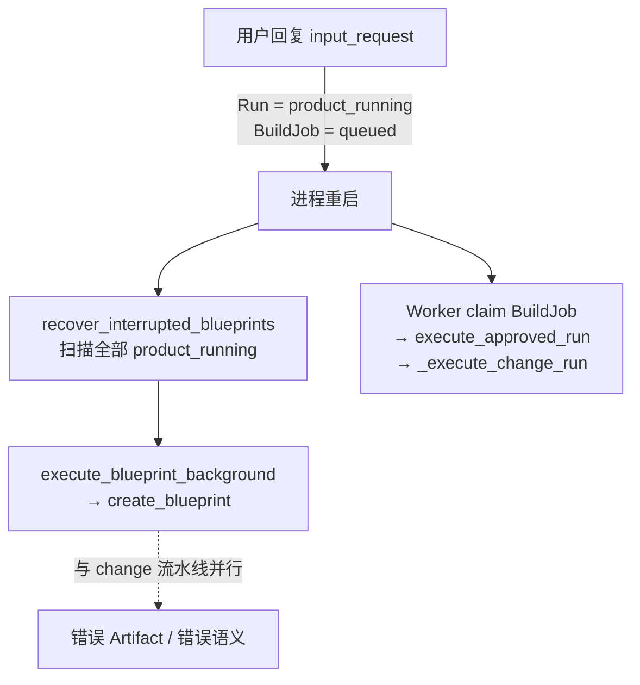

# 【检查】V1 统一 Chat 与 HITL 核心纵切检查

[toc]

> 类型：检查｜状态：已归档｜日期：2026-07-14｜范围：统一 Project Chat、HumanTask/HITL、Lead 路由、已有代码修改（相对工作区未提交实现做缺陷审查）

> **2026-07-14 Update：** 8 项发现均已修复。Blueprint 启动恢复只扫描首次 `build` Run，`ai_edit` 只由持久化 BuildJob/Worker 恢复；同文幂等重试会在执行尚未推进时重新 dispatch。HumanTask 与 Run 的 approve/reject、respond/stale 状态迁移改为同事务双 CAS，并校验 Run 必须处于对应等待态；重复 subject 只复用 pending task，已决 task 后会创建新任务。基线 stale 现在同步把 Run 迁为带 `BASE_VERSION_CHANGED` 的 `cancelled`，记录系统消息；前端保留 API `code`、收到 409 后刷新 Run，并展示“澄清已失效”而非 ScopeStop。正式约束已同步到 [V1 统一 Chat 与 Human-in-the-loop](../../design/V1/产品设计/06-统一Chat与Human-in-the-loop.md)。自动化证据见 `tests/integration/test_worker_recovery.py`、`test_human_tasks.py`、`test_project_change_chat.py`；后端 112 项测试全部通过，相关 Python 文件 Ruff 通过，Studio TypeScript 与生产构建通过。Vite 仅保留既有的大 chunk 告警，不影响本次正确性结论。本文移入归档。

- 设计基线：[V1 统一 Chat 与 Human-in-the-loop](../../design/V1/产品设计/06-统一Chat与Human-in-the-loop.md)
- 相关检查：[16｜对话式 AI Coding 实现检查](../待办/16-[综合]-2026-07-14-对话式AI-Coding实现检查.md)
- 代码基线：2026-07-14 工作区（`another_atom/agent/tasks.py`、`orchestrator.py`、`api/routes.py`、`studio/src/App.tsx`、`tests/integration/test_human_tasks.py`、`test_project_change_chat.py`）
- 审查性质：**代码正确性缺陷**，不是功能完成度清单。已知未做项（Stop/Cancel、富 Diff、VersionMaterialization、完整 Risk Policy 适配器、消息幂等 key、Markdown ProductSpec、V2 任务图）不重复记为新缺陷。

## 1. 检查结论

HumanTask 持久化、PM `needs_input`、同文 CAS、澄清期释放写锁、`direct` 不建版本、基线 stale 检测、Edit/Vim/AI 写互斥等主路径可用，且有集成测试。

本次发现的问题集中在**恢复误路由、幂等重试不重新执行、stale/审批与 Run 状态机不同步**：

| 编号 | 严重度 | 问题 | 位置 |
| --- | --- | --- | --- |
| 1 | P0 | 启动恢复把 `ai_edit` 的 `product_running` 当成首次 Blueprint 重放 | `tasks.py:recover_interrupted_blueprints` |
| 2 | P1 | HumanTask 同文幂等重试不重新 dispatch，执行可能永久卡住 | `routes.py:respond_to_human_task` |
| 3 | P1 | stale 后 Run 仍为 `needs_input` 且无 pending task，前端误入 ScopeStop 并停轮询 | `routes.py` + `App.tsx` |
| 4 | P1 | Approval reject 对 Run 无 CAS，可与 approve 并发互相覆盖 | `routes.py:approve_blueprint` / reject 分支 |
| 5 | P1 | stale 标记用 ORM 直接写，未与 respond 的 CAS 对称 | `routes.py` 基线检查分支 |
| 6 | P2 | `_create_human_task` 命中已 resolved 同 subject 时原样返回，可造成 needs_input 无 pending | `orchestrator.py:_create_human_task` |
| 7 | P2 | respond 未校验 Run 必须处于可恢复等待态 | `routes.py:respond_to_human_task` |
| 8 | P2 | 前端 409/stale 后不 refreshRun；错误只展示 message 不映射 code | `App.tsx` / `api.ts` |

## 2. P0 发现

### 2.1 启动恢复误将 `ai_edit` 重放为 Blueprint 流水线

下图回答：「澄清回复后的 `ai_edit` Run，进程重启时会走哪条恢复路径？」

**读图要点：**

1. `ai_edit` 澄清恢复后状态是 `product_running`，并已有 queued `BuildJob`（`routes.py` 约 1223–1274 行）。
2. `recover_interrupted_blueprints`（`tasks.py:45-58`）按状态扫描**全部** `product_running`，一律调用 `create_blueprint`，不看 `run.trigger`。
3. `create_blueprint` 早退列表不含 `product_running`（`orchestrator.py:79-95`），会对 `ai_edit` 再跑首次构建 PM→Blueprint 路径。
4. 同时 Worker 可能 claim 同一 Run 的 BuildJob 走 `_execute_change_run`，两条路径冲突。

**影响：** 修改澄清后的重启可污染 Artifact、错误创建版本语义，或与 change pipeline 竞态。

**处理方向：** recovery 按 `trigger` / `current_stage` / 是否已有 BuildJob 分流；`ai_edit` 只走 `execute_approved_run`（或仅依赖 Worker），不得调用 `create_blueprint`。补「澄清恢复 → 杀进程 → 重启」集成测试。

## 3. P1 发现

### 3.1 同文幂等重试不重新 dispatch

`respond_to_human_task` 在 task 已是 `answered` 且文本相同时直接 `return _run_view`（约 1165–1172 行），不检查 Run 是否仍停在 `product_running`、也不重发 `job_dispatcher` / `blueprint_executor`。

若首次 CAS 已 commit，但 BackgroundTasks / dispatcher 在 crash 前未执行，用户用相同文本重试会得到 202，流水线却永不继续。

**处理方向：** 幂等分支在 Run 仍待执行（`product_running` / `build_queued` 且无进展）时重新 dispatch；测试断言「执行丢失后同文重试能恢复」。

### 3.2 stale 后 Run/UI 卡死

基线变化时 HumanTask → `stale` 并返回 `BASE_VERSION_CHANGED`，但 **Run.status 仍为 `needs_input`**，且 `_run_view` 查不到 `pending` task。

前端：`needs_input && !input_request` 走 ScopeStop；`needs_input` 又在终态集合中停止轮询。用户看不到「基线已变，请基于新版本重新发起」，而是错误的范围确认 UI。

**处理方向：** stale 时用 CAS 更新 HumanTask，并将 Run 迁到 `cancelled`/`failed`（或专用终态），写系统消息；前端区分 `scope_review` 与「澄清已失效」。

### 3.3 Approval reject 与 approve 竞态

- approve：`Run` 用 CAS `awaiting_approval → build_queued`；HumanTask 直接赋值 `approved`。
- reject：HumanTask 用 CAS；`Run.status = cancelled` **无 CAS**。

并发下 reject 可能覆盖已 queued 的 Run，造成 Run / HumanTask / BuildJob 不一致。

**处理方向：** reject 对 Run 使用对称 CAS（例如仅当仍为 `awaiting_approval` 才改为 `cancelled`）；approve 对 HumanTask 也用 CAS。补 approve vs reject 并发测试。

### 3.4 stale 写非 CAS

基线失败分支直接 `task.status = stale`（约 1184–1186 行），与回答路径的 `UPDATE ... WHERE status=pending` 不对称，可与并发 respond 竞态。

**处理方向：** stale 同样 `UPDATE WHERE status=pending`；rowcount≠1 时按已决结果返回。

## 4. P2 发现

1. **`_create_human_task` 去重**：同 `subject_hash` 已存在（含 `answered`/`stale`）则原样返回，随后 Run 仍可被设为 `needs_input`，但无 pending task（与发现 3 同类 UI 异常）。应只复用 `pending`，或创建新 subject / 复活 pending。
2. **respond 缺 Run 前置状态**：未要求 Run 为 `needs_input`/`awaiting_approval`；异常数据下可能把已 `failed`/`cancelled` 的 Run「复活」。
3. **前端错误处理**：`BASE_VERSION_CHANGED` 等 409 只 `setError`，不 `refreshRun`；API 层不暴露 `code` 做定向引导。

## 5. 已确认工作正常（非缺陷）

- HumanTask 归属校验与 owner-scoped 测试。
- `input_request` 主路径 CAS；澄清期释放 `active_write_run_id`；`ai_edit` 恢复时重新 CAS 占锁并复查基线。
- Lead `direct` 不创建 ProjectVersion（集成测试覆盖）。
- 等待澄清期间基线变化会使 task 进入 `stale`（集成测试覆盖；问题在 Run/UI 未同步，见发现 3）。
- Edit / Vim / AI 写互斥主路径。
- 失败后同 Project 继续、`ai_edit` 不再误走首页 `createRun`（相对 Review 16 原发现已推进）。

## 6. 测试覆盖缺口

| 场景 | 关联 |
| --- | --- |
| `ai_edit` 澄清恢复后进程重启 + recovery/worker | 发现 1 |
| answered 后 executor 丢失 + 同文重试应再 dispatch | 发现 2 |
| stale 后 Run 终态与前端路径 | 发现 3 |
| approve vs reject 并发 | 发现 4 |
| stale vs respond 并发 | 发现 5 |
| PM 二次提出相同澄清问题 | 发现 6 |

## 7. 处理要求

1. **发现 1（P0）** 优先修复并补重启恢复测试。
2. **发现 2–4（P1）** 修复需自动化测试证据；发现 3 需前后端一并改。
3. **发现 5–8（P2）** 可与 HumanTask 状态机收敛同批处理。
4. 功能完成度与已知边界见设计 06 §7；本文只跟踪正确性缺陷。关闭后在顶部追加 dated Update 与证据，再归档。
5. Review 16 顶部的「实现进度」Update 描述的是功能推进，**不能替代**本文发现的关闭证据。
