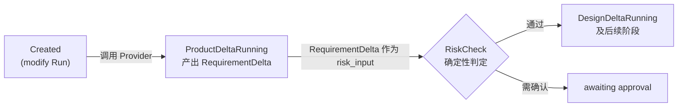

# 【检查】V1 基于现有代码的对话式 AI Coding 技术设计评审

[toc]

> 类型：检查｜状态：待处理｜日期：2026-07-13｜范围：V1 对话式 AI Coding 技术设计（文档评审，未实现前）

## 2026-07-14 设计决策更新

本轮产品验收重新确认：所有自然语言代码修改都先形成修改任务，并通过“修改代码”workflow Approval 后再创建 `ai_edit` Run；Engineer 接收完整有效文档链和基线全量受控源码，输出代码 Diff，由 Runtime 在隔离候选工作区 apply。原发现 5 的“全量 CandidateAppSpec”前提和发现 8 的“普通修改风险驱动自动继续”结论已被新决策替代。

同日补充决定：Runtime 先在本地计算完整 Engineer Context；未超限时发送全量源码，超限时才确定性裁剪并记录 ContextReceipt，不再以 Context 超限直接终止。本决定替代本文发现 5 中“超限直接失败”的建议。

新的实现偏差、目标链路和验证要求由 [20｜Project 对话路由与代码修改授权检查](./20-[综合]-2026-07-14-Project对话路由与代码修改授权检查.md)接管；本文其他状态机、配额、写锁和幂等问题仍保持待办。

- 评审对象：[V1 基于现有代码的对话式 AI Coding](../../design/V1/技术设计/02-[Agent]-基于现有代码的对话式AI-Coding.md)
- 产品基线：[V1 通过对话修改现有项目](../../design/V1/产品设计/03-通过对话修改现有项目.md)
- Agent 基线：[V1 多 Agent 设计](../../design/V1/技术设计/01-[Agent]-多Agent设计.md)
- 代码基线：2026-07-13 工作区（`another_atom/storage/models.py`、`another_atom/api/routes.py`）
- 后续实现检查：[16｜综合｜对话式 AI Coding 实现检查](./16-[综合]-2026-07-14-对话式AI-Coding实现检查.md)（落地后的代码与测试核对）
- 评审性质：该功能尚未实现，本文检查的是设计文档自身的一致性、与产品设计的对齐、与现有代码前提的匹配，不含运行时验证

## 1. 评审结论

方案的核心判断成立，不需要推翻重来：

- Agent 不互调、Runtime 以不可变 Artifact 传递 Handoff，延续了 V1 已验证的协作模型；
- SourceDiff 定义为 Runtime Evidence 而非 Agent 自报结果，与 Validator 不可改写的既有原则一致；
- Project 单写 CAS、最终版本 CAS、`VersionMaterialization` 幂等物化三层保护覆盖了"模型调用几十秒期间世界会变"的主要风险；
- 明确拒绝"把 follow-up 拼进原 Prompt"的捷径，并给出了不能这样做的可验证理由。

需要处理的问题集中在四类：**消息/Run 状态机内部不自洽**（发现 1、2）、**配额与 Risk Policy 的时序矛盾**（发现 3）、**审批等待期间的写锁策略缺失**（发现 4）、**与产品设计和现有代码的若干未对齐点**（发现 5–10）。这些都应在开始实现（设计文档 §17 实施顺序第 1 步）之前修订进设计文档，否则实现时会各自即兴发挥。

| 编号 | 严重度 | 问题 | 类型 |
| --- | --- | --- | --- |
| 1 | P1 | 消息状态在 §4.1、§7.2、§15 三处定义不一致 | 文档自洽 |
| 2 | P1 | 修改 Run 状态机缺少用户 Stop/Cancelled 路径，与产品设计冲突 | 产品对齐 |
| 3 | P1 | 配额"Risk Policy 通过后预占"与 RequirementDelta 是 Risk 输入相矛盾 | 文档自洽 |
| 4 | P1 | `awaiting_risk_approval` 期间写锁无超时和取消策略 | 设计缺口 |
| 5 | P2 | Context 确定性裁剪与全量 CandidateAppSpec 输出互相矛盾 | 设计缺口 |
| 6 | P2 | 澄清回复与 ChangeBrief 草稿缺少显式关联字段 | 设计缺口 |
| 7 | P2 | 既有写入口（结构化 Edit / Vim / Restore / Resolve）改造未列入实施顺序 | 代码对齐 |
| 8 | P2 | 产品设计 §12 对本方案的引述已过时，双向链接未同步 | 文档同步 |
| 9 | P3 | 幂等 key 重试语义与唯一约束的关系未写明 | 文档自洽 |
| 10 | P3 | BaseSourceSnapshot 是否持久化为 Artifact 未说明 | 文档自洽 |

## 2. P1 问题

### 2.1 消息状态在三处定义不一致

设计文档 §4.1 给 `ConversationMessage.status` 的枚举是：

```text
status: queued | routing | completed | failed | cancelled
```

但 §7.2 的消息状态机使用了另一组中间状态：`answered`、`clarification_needed`、`change_brief_ready`、`awaiting_risk_approval`、`linked_to_run`。文档没有说明这些是 `status` 的取值、独立的结果字段，还是从 Run 状态派生的视图。§15 错误矩阵又写"Project 已有写任务时消息保留为**草稿**"，而枚举中不存在 draft。

另外 §7.2 中 `awaiting_risk_approval` 之后没有任何出边：审批通过如何到 `linked_to_run`、拒绝或过期后消息进入什么终态，均未定义。

**影响：** 状态字段是 API、UI 轮询和恢复逻辑的共同依据，三处不一致会导致实现各选一套，恢复扫描（"进程重启后 `queued/routing` 消息必须可重新领取"）无法确定要扫描哪些值。

**建议：** 在 §4.1 给出唯一的完整状态枚举（含 draft 或删除草稿说法、含审批拒绝/过期路径），§7.2 状态机与 §15 矩阵只引用该枚举。

### 2.2 修改 Run 缺少 Stop/Cancelled 路径

产品设计 §4.3 明确要求修改执行期间展示 **Stop 入口**。但技术设计只在 §7.2 覆盖了 `user stop before Run -> cancelled`；§7.3 的修改 Run 状态机从 `Created` 到 `Completed` 没有任何 `Cancelled` 或 `Stopping` 状态，也没有定义 Stop 时：

- 写占用（`active_write_run_id`）何时释放；
- 已预占配额如何结算（§12.1 只覆盖失败结算）；
- 已产生的中间 Artifact 是否保留、能否被后续子 Run 复用（§12.3 只覆盖失败后的子 Run）；
- §14 事件清单中也没有 `change.run_cancelled` 或等价事件。

**影响：** 这是产品承诺的可见控件，缺失路径意味着实现时要么砍掉 Stop（违反产品设计），要么临时发明语义。§16 测试清单也完全没有 Stop 用例。

**建议：** 在 §7.3 补 `Cancelled` 终态及各阶段可中断点，明确写占用释放、配额结算、Artifact 保留规则；§14 补事件；§16 补测试项。

### 2.3 配额预占时序与 Risk Policy 位置矛盾

下图对照 §7.3 的实际阶段顺序与 §12.1 的配额声明，矛盾出在产品阶段。



按 §8，Risk Policy 的输入包含 `RequirementDelta`，即产品阶段的 Provider 调用**必然发生在 Risk 判定之前**。但 §12.1 写的是"modify 在 Risk Policy 通过后按阶段预占"。产品阶段这次真实调用的配额何时预占、Risk 被拒绝后如何结算，文档没有答案。§15 的"配额不足：保存消息和 ChangeBrief，不启动下游"也暗示配额检查发生在产品阶段之前，与"通过后预占"再次冲突。

**建议：** 把 §12.1 改为两段式：Lead 路由 + 产品阶段（ChangeBrief 到 RequirementDelta）在 modify 意图确定时预占；Risk Policy 通过后再预占设计及以后阶段。Risk 拒绝或等待确认超时的场景按"非 LLM 失败"规则结算已发生请求。

### 2.4 审批等待期间写锁无超时策略

§10.1 规定创建修改 Run 时以 CAS 取得 `active_write_run_id`，且"Run 进入 completed/failed/cancelled/needs_input 后释放"。而 §7.3 的 `awaiting approval` 不属于这四种状态——用户如果不来确认，写锁**无限期持有**，期间结构化 Edit、Vim Save、Restore 全部返回 `PROJECT_WRITE_BUSY`（§10.1 要求它们共享写边界）。

产品设计 §7 要求高风险操作"在执行前确认"，但没有承诺用户会及时响应。文档没有定义：审批等待是否占锁、是否有超时、超时后 Run 进入什么状态、用户能否主动放弃待审批的修改以解锁 Project。

**建议：** 明确 `awaiting approval` 的锁策略。可选方案：等待审批期间不占写锁（Risk 通过、真正进入设计阶段时才 CAS 取锁，取锁时同时校验基线未变），或保留占锁但增加超时转 `needs_input` 并释放。前者与"任一基线变化后旧 Approval 失效"（§8）天然兼容，推荐前者。

## 3. P2 问题

### 3.1 Context 裁剪与全量 CandidateAppSpec 输出矛盾

§5.3 说 Context 超限时"按用户选中文件、Diff 相关文件和入口文件确定性裁剪"。但 §4.7 规定 Engineer 输出**完整** `CandidateAppSpec`，§9 要求"未变化的文件应保持 byte-level 相同"。两者组合后：模型没有读到的被裁剪文件，不可能在全量输出中逐字复原，裁剪一旦触发必然违反 byte-level 保持约束。

V1 当前受控仓库只有 `index.html`、`styles.css`、`app.js`、`app-spec.json` 四类文件，全量传入可行，矛盾暂不触发。但文档把裁剪写成了通用降级方案，未指出它与全量输出模式互斥。

**建议：** 在 §5.3 注明：确定性裁剪只适用于未来 patch/定向输出模式；在 CandidateAppSpec 全量输出模式下，源码超限应直接失败并提示（如 `CONTEXT_OVERFLOW`），不允许静默裁剪。

### 3.2 澄清回复缺少显式关联

产品设计 §4.2 要求澄清闭环："澄清完成前不修改代码"。但 `ConversationMessage`（§4.1）没有 `parent_message_id` 或 `reply_to` 字段，Lead 判断"这条新消息是对上一条澄清的回答还是全新请求"只能依赖 `ProjectContextSnapshot` 中"最近少量用户可见消息"的隐式窗口。同样未定义的还有：澄清前已形成的 ChangeBrief 草稿（若有）在用户回答后是重建还是增量修订。

**建议：** 给 ConversationMessage 增加可选 `reply_to_message_id`；明确澄清后的处理是"带着原消息 + 澄清问答重新走一次 Lead 路由"，不保留跨消息的隐藏草稿状态。

### 3.3 既有写入口改造未列入实施顺序

§10.1 要求"结构化 Edit、Vim Save、Resolve、Restore 和 AI 修改共享同一个 Project 写边界"，§18 也重申结构化 Revision 必须接入写占用和版本 CAS。但 §17 实施顺序的五步全部围绕新功能，没有一步显式包含"改造既有写入口"。

当前代码的差距比文档描述的更大：`revise_project` 完全没有并发保护——

```1269:1284:another_atom/api/routes.py
    latest_number = db.scalar(
        select(func.max(ProjectVersion.version_number)).where(
            ProjectVersion.project_id == project.id
        )
    )
    version = ProjectVersion(
        project_id=project.id,
        run_id=current.run_id,
        version_number=(latest_number or 0) + 1,
        source=VersionSource.EDIT.value,
        app_spec=app_spec.model_dump(mode="json"),
        data_profile=current.data_profile,
        validation_report=validation.model_dump(mode="json"),
        review_report=review_report.model_dump(mode="json"),
    )
```

`max(version_number) + 1` 的读-改-写没有任何锁或 CAS，两个并发 Edit 会撞 `uq_project_version` 唯一约束返回 500；Restore 和 Resolve 端点同样如此。`Project` 表也尚无 `active_write_run_id` 列。若按 §17 顺序先交付第 1–3 步，AI 修改的最终 CAS 会因为 Edit 不走写边界而频繁失败（虽然一致性仍守住，但用户视角是"修改总被莫名打断"）。

**建议：** 在 §17 第 4 步显式加入"为 revise/restore/resolve/vim save 接入 `active_write_run_id` 检查"，并把它作为 AI 修改上线的前置条件而不是可选优化。

### 3.4 产品设计对本方案的引述已过时

产品设计 §12 仍写着：现有技术提案中"所有 ChangeProposal 均等待确认"的方案需要在后续技术设计中调整为风险驱动确认。但技术设计 §8 已经完成了这个调整（"正常修改不进入统一 `awaiting_change_approval`，这修正了旧提案中……固定 Gate"）。产品文档的这句"待调整"陈述已失效，会误导读者以为两文档仍冲突。

**建议：** 更新产品设计 §12 该段为"已在技术设计 §8 采纳风险驱动确认"，保持双向链接同步。

## 4. P3 问题

### 4.1 幂等 key 重试语义未写明

§4.1 规定"同一用户、Project 和 `idempotency_key` 唯一"；§15 又说 Lead 失败后"可重试同一 idempotency key"。两者可以兼容（重试是对既有 failed 消息行的显式重新入队，不是重新 INSERT），但文档没有写明这一点，也没有定义客户端重放 POST 命中唯一约束时返回什么（应返回既有消息的当前状态而非报错）。

### 4.2 BaseSourceSnapshot 的持久化归属未说明

§12.2 的阶段恢复 Artifact 清单不含 `base_source_snapshot`。从 §4.6 可推断它可以由 `base_git_commit` 确定性重建（类似 SourceDiff"可由相同 base/candidate hash 确定性重算"），无需持久化——但这是读者推断，不是文档陈述。恢复逻辑实现者需要明确答案：重启后是重读 Git 重建 Snapshot 并校验 `source_manifest_hash`，还是当作缺失 Artifact 重跑阶段。

**建议：** 在 §12.2 补一句"BaseSourceSnapshot 与 SourceDiff 同为确定性可重算产物，恢复时从 `base_git_commit` 重建并校验 manifest hash，不作为阶段检查点"。

## 5. 无需修改的确认项

评审中核对过、结论为"设计正确、维持现状"的点，记录以免重复讨论：

- **`LeadMessage` 不复用**：当前表结构（`another_atom/storage/models.py:50`）只有 `user_id/content/route`，无 Project 关联，与 §2 的差距描述一致，新建 ConversationMessage 是正确选择；
- **`ai_edit` 局部唯一约束**：只对 `source=ai_edit` 建 `run_id` 唯一约束的理由成立——当前 `revise_project` 确实复用原 Build 的 `run_id`（routes.py:1276）且允许同一 Run 多个 Edit 版本，全局 `(run_id, source)` 唯一会破坏现状；
- **Artifact 类型唯一恢复**：现有 `uq_run_artifact_type` 约束（models.py:130）与 §12.2"每个修改 Run 的 Artifact 类型唯一"匹配，repair 阶段用独立类型名即可复用该机制；
- **固定流水线不跳阶段**：§3.3 允许阶段输出"无变化，沿用基线"但不允许静默跳过，与产品设计 §5 逐条对齐；
- **文档自身链接**：本文档头部三个基线链接均指向真实文件，无断链。

## 6. 处理要求

按 Review 生命周期，本文归档前需满足：

1. 发现 1–4（P1）在设计文档中完成修订，修订后的状态机、配额时序和锁策略写回 [技术设计](../../design/V1/技术设计/02-[Agent]-基于现有代码的对话式AI-Coding.md) 对应章节；
2. 发现 5–8（P2）分别修订技术设计 §5.3/§4.1/§17 和产品设计 §12；
3. 发现 9–10（P3）可与上述修订合并处理；
4. 每项处理完成后在本文顶部追加 dated Update 并给出 Design diff 链接。
