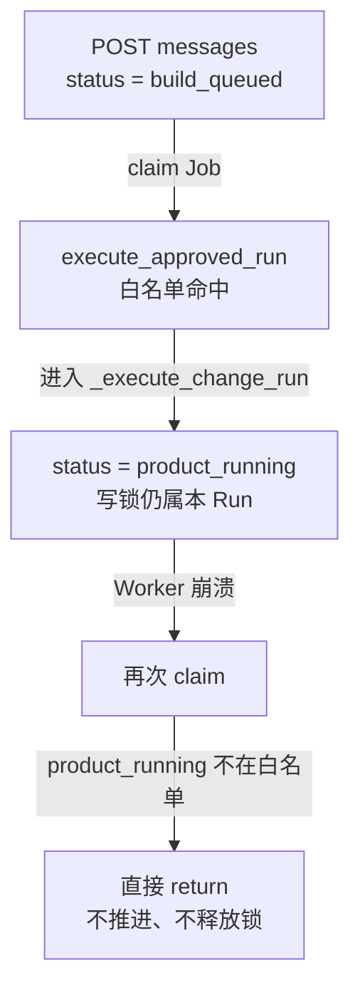

# 【检查】V1 对话式 AI Coding 实现检查

[toc]

> 类型：检查｜状态：部分完成｜日期：2026-07-14｜范围：V1 Project 对话修改（API、Worker、Studio）

## 2026-07-14 补充检查

后续用户验收确认：此前“已有 Project 消息先由 Lead 做 direct/team 路由”的实现更新只证明 direct 不创建新版本，不能证明消息在创建 Run 前完成路由。当前代码仍先创建 `ai_edit` Run、BuildJob 和写占用，再在 Worker 内调用 Lead；Lead 也没有收到正确的 Project Context，Engineer 未收到完整有效文档链和基线全量源码。

这些问题及新的“修改代码”workflow Approval、模型输出 Diff、Runtime 隔离 apply 方案统一由 [20｜Project 对话路由与代码修改授权检查](./20-[综合]-2026-07-14-Project对话路由与代码修改授权检查.md)接管。本文原始实现检查和其他待办项继续保留。

## 2026-07-14 实现更新

本轮以 [统一 Chat 与 Human-in-the-loop](../../design/V1/产品设计/06-统一Chat与Human-in-the-loop.md) 为合并基线，已完成以下修复：

- **[已修复｜恢复]** `product_running` 已进入 Worker 可恢复状态集合，已有阶段 Artifact 继续复用。
- **[已修复｜单写边界]** AI 修改、结构化 Edit 和 Vim Save 共用 Project 写占用；等待 PM 补充时释放，占用恢复时重新取得并复查基线。
- **[已修复｜失败继续]** `ai_edit` 重试继续走原 Project 修改入口；首轮构建失败且尚无版本时，也能在原 Project Chat 中修正请求并启动新 Run。
- **[已修复｜错误语义]** 写占用与基线变化分别返回 `PROJECT_WRITE_BUSY` 和 `BASE_VERSION_CHANGED`；等待期间基线变化会使 HumanTask 进入 `stale`。
- **[已修复｜对话状态]** 已有 Project 消息先由 Lead 做 `direct/team` 路由；PM 可创建持久化 `input_request`，用户回复后通过 CAS 恢复同一 Run。adapted Blueprint 同步登记 `approval` HumanTask。
- **[已修复｜Studio]** 消息加载错误可见，历史展示扩至可滚动的最近 20 条；PM 问题、补充回复、失败记录与构建状态保留在同一 Project Chat。
- **[仍待处理]** Stop/Cancel API、富 Diff 结果卡片、通用 Risk Policy 业务适配器、VersionMaterialization、消息幂等 key、`BASE_SOURCE_MISMATCH` 和外部仓库导入。

验证证据包括 PM 暂停/同 Run 恢复、重复回复、越权、direct 不建版本、等待期间基线失效、首轮失败在原 Project 继续，以及 Edit/Vim/AI 写互斥测试。原检查正文保留为发现记录；以上更新表示对应问题的当前状态，不改写历史结论。

按合并设计 06 的里程碑核对见：[19｜综合｜统一 Chat 与 HITL 核心纵切检查](./19-[综合]-2026-07-14-统一Chat与HITL核心纵切检查.md)。

- 产品基线：[V1 通过对话修改现有项目](../../design/V1/产品设计/03-通过对话修改现有项目.md)
- 技术基线：[V1 基于现有代码的对话式 AI Coding](../../design/V1/技术设计/02-[Agent]-基于现有代码的对话式AI-Coding.md)
- 前次检查：[14｜Agent｜对话式 AI Coding 技术设计评审](./14-[Agent]-2026-07-13-对话式AI-Coding技术设计评审.md)（实现前的设计文档检查；本文检查的是落地代码）
- 代码基线：2026-07-14 工作区（`another_atom/agent/orchestrator.py`、`another_atom/api/routes.py`、`another_atom/build/worker.py`、`studio/src/App.tsx`、`tests/integration/test_project_change_chat.py`）

## 1. 检查结论

核心修改纵切已经可跑通：用户在已有 Project 发消息 → 取得写锁 → 绑定基线版本与 Git commit → 固定下游流水线 → Runtime SourceDiff → 校验通过后创建 `ai_edit` 版本，且不移动发布指针。集成测试覆盖了主路径、双 AI 写互斥、失败释放锁与失败上下文、双用户消息隔离。

与设计自述一致的缺口（answer/clarify、Risk Policy、Diff 结果卡片、VersionMaterialization、外部导入）仍然存在。本次额外发现：**已宣称“阶段恢复可用”的路径在 `product_running` 上断裂**，以及写边界、前端失败重试等实现缺陷。

| 编号 | 严重度 | 问题 | 位置 |
| --- | --- | --- | --- |
| 1 | P0 | Worker 重领时忽略 `product_running`，`ai_edit` 可能永久卡死并占写锁 | `orchestrator.py:execute_approved_run` |
| 2 | P1 | Vim Save 不检查 `active_write_run_id`，可绕过 AI 写锁 | `routes.py:save_project_sandbox` |
| 3 | P1 | 结构化 Edit 只避让、不占用写锁，可与 AI 修改竞态 | `routes.py:revise_project` |
| 4 | P1 | `ai_edit` 失败后前端「重试」走 `createRun`，会发起全新首次构建 | `App.tsx:FailedState` |
| 5 | P2 | CAS 失败一律 `PROJECT_WRITE_BUSY`，未区分基线已变 | `routes.py:create_project_change` |
| 6 | P2 | 消息加载失败静默清空历史；只渲染最近 4 条纯文本 | `App.tsx:ProjectChatPanel` |
| 7 | P2 | 修改进行中切全屏 BuildingState，Preview/对话不可见 | `App.tsx:Workspace` |
| 8 | P2 | 无 Stop/Cancel API；`CANCELLED` 对 Project change 不可达 | API / Worker |
| 9 | 设计差距 | answer/clarify、Risk Policy、Diff 卡片、VersionMaterialization、幂等 key、BASE_SOURCE_MISMATCH、外部导入 | 设计 §2 / §17 |

## 2. P0 发现

### 2.1 Worker 无法恢复 `product_running` 的修改 Run

下图回答：「`ai_edit` Run 进入 Lead/产品阶段后，Worker 崩溃再领取时会发生什么？」

**读图要点：**

1. 创建修改时入口状态是 `build_queued`，首次领取可以进入 `_execute_change_run`。
2. 流水线一开始就把 Run 写成 `product_running`（`orchestrator.py` 约 428 行），同时 `active_write_run_id` 仍指向该 Run。
3. `execute_approved_run` 白名单只有 `build_queued`、`architect_running`、`engineer_running`、`building`、`data_running`、`review_running`，**不含** `product_running`。
4. 重领后静默返回：Job 可能被标完成或反复空转，但 Project 写占用不会按成功/失败路径释放（除非另有崩溃清理命中）。

**影响：** 设计 §12.2 要求按 Artifact 恢复已完成阶段；当前实现在 Lead/产品阶段崩溃后既不续跑也不明确失败。用户侧表现为「修改卡住、其他写入口全部 `PROJECT_WRITE_BUSY`」。

**处理方向：** 白名单加入 `RunStatus.PRODUCT_RUNNING`；补集成测试：在 ChangeBrief 或 RequirementDelta 阶段强制中断 Worker 后重领，断言流水线继续且不重复已有 Artifact。同步检查首次 Build 是否也把 `product_running` 交给同一入口。

## 3. P1 发现

### 3.1 Vim Save 绕过 AI 写锁

`revise_project` 与 `restore` 在入口检查 `project.active_write_run_id`；`save_project_sandbox` 没有等价检查，可在 AI 修改持锁期间创建新版本并更新 `latest_version_id`。

**影响：** 进行中的 `ai_edit` 在最终 CAS 时因基线变化失败；或 Git/版本序与用户预期不一致。设计 §10.1 / 产品 §12 要求 Vim 与 AI 修改共享写边界。

**处理方向：** `save_project_sandbox` 在写版本前拒绝非空 `active_write_run_id`；补「AI 修改进行中 → Vim Save 返回 409」测试。

### 3.2 结构化 Edit 不占用写锁

`revise_project` 只在「已有 AI 写锁」时拒绝，自身不 CAS 设置 `active_write_run_id`。Edit 执行窗口内，另一请求仍可通过 `create_project_change` 的 CAS（条件是 `active_write_run_id IS NULL`）。

**影响：** Edit 与 AI 修改并发时，先完成的一方改变 `latest_version_id`，另一方最终失败或产生意外版本序。设计 §16.2 要求「结构化 Edit/Vim 与 AI 修改冲突时不能互相覆盖」——当前只覆盖了「AI 忙时拒 Edit」单向场景。

**处理方向：** Edit（及必要时 Restore）在变更前短时占用写锁，或与 AI 修改共用同一 CAS 条件；补双向冲突测试。

### 3.3 `ai_edit` 失败重试走错路径

`FailedState` 的 Retry 固定调用 `api.createRun(run.prompt, ...)`。对 `trigger === "ai_edit"` 的失败 Run，这会按原始 prompt 发起**全新首次构建**，而不是基于最后成功版本再次 `createProjectChange`。

**影响：** 违背产品 §9「新一轮仍以最后成功版本为代码基线」；用户以为在重试修改，实际可能重建整个应用。

**处理方向：** 按 `run.trigger` 分支：`ai_edit` 走 Project 对话修改入口（可用失败页下方已有的对话面板，或显式调用 `createProjectChange`）；按钮文案区分「重试修改」与「重新构建」。

## 4. P2 发现

### 4.1 CAS 错误码未区分忙与基线已变

`create_project_change` 的 UPDATE 同时要求 `latest_version_id = base` 且 `active_write_run_id IS NULL`。失败时统一抛 `PROJECT_WRITE_BUSY`。设计 §15 区分 `PROJECT_WRITE_BUSY` 与 `BASE_VERSION_CHANGED`。

**处理方向：** 失败后读当前 Project：有活跃写锁报 busy；`latest_version_id` 已变报 `BASE_VERSION_CHANGED`。

### 4.2 对话历史加载与展示过弱

- 加载失败时 `catch` 置空数组，已定义的错误文案未使用，用户会误以为没有历史。
- 只 `slice(-4)` 且只渲染 `content`，忽略 `message_type` / `payload`（change_brief 的 preserve、acceptance、基线版本；result 的 version_number 等）。

**处理方向：** 加载失败 `setError`；按 `message_type` 渲染任务/结果/错误卡片；至少展示完整可滚动历史。

### 4.3 修改进行中 UX 违背产品 §4.3

提交成功后 Workspace 切到全屏 `BuildingState`，Preview、文件树与对话面板被卸掉；阶段文案仍是首次构建的「生成应用规格」等，未按 `ai_edit` 切换为「分析现有代码 / 修改已有实现 / 校验本次变更」。

**处理方向：** 修改进行中保留 Preview + 对话；Timeline / Building 文案按 `run.trigger` 分支。

### 4.4 无 Stop / Cancel

`RunStatus.CANCELLED` 存在，但无取消修改 Run 的 API；产品 §4.3 要求修改期间展示 Stop。当前用户只能等失败或完成。

**处理方向：** 与设计评审 14 发现 2 一并补 Cancel 路径（写锁释放、配额结算、Artifact 保留规则），再补前端 Stop。

## 5. 已声明未实现的设计差距（非本次新缺陷）

下列项设计文档 §2 / §17 与产品 §12 已自述为后续工作；代码核对确认仍未落地，记入本文以免与「已实现」混淆：

| 差距 | 代码侧证据 |
| --- | --- |
| answer / clarify 路由 | `create_project_change` 直接建 `ai_edit` Run；无 `ProjectLeadDecision` |
| Risk Policy / 审批 | `_execute_change_run` 在 RequirementDelta 后直接进 Architect |
| 独立 Diff 结果卡片 | SourceDiff 已持久化为 Artifact；Studio 未接 |
| VersionMaterialization | 无对账表；Git commit 后、DB commit 前崩溃可能产生孤儿 commit |
| 消息 `idempotency_key` / 异步状态机 | `ProjectMessage` 无 status / idempotency；POST 返回 RunView |
| `BASE_SOURCE_MISMATCH` | 未比对 `ProjectVersion.app_spec` 与 Git 文件 hash |
| 外部 GitHub / 本地目录导入 | 不在本纵切范围 |
| Engineer Prompt 直喂 Git 源码 | 修订基于 DB 中 `base_app_spec`；Snapshot 主要用于 Diff |

## 6. 已确认工作正常的项

- Project 消息列表与提交归属校验；双用户不能读对方消息（`test_project_change_chat.py`）。
- 修改 Run 绑定 `base_version_id`；BaseSourceSnapshot 从基线 Git commit 读取受控文件。
- ChangeBrief → RequirementDelta → 修订 ArchitectureSpec / AppSpec → Runtime SourceDiff → Data / Validator / Reviewer。
- 成功创建 `source=ai_edit` 版本；同 Run 版本幂等复用；发布指针不变。
- 双并发 AI 修改仅一个取得写锁；失败释放写锁并注入 `previous_failure` 上下文。
- 结构化 Edit / Restore 在 AI 写锁持有期间拒绝写入（单向避让已测）。

## 7. 测试覆盖缺口

| 场景 | 现状 |
| --- | --- |
| Worker 在 `product_running` / 各阶段重启恢复 | 未测（对应发现 1） |
| Vim + AI 写锁交叉 | 未测（对应发现 2） |
| Edit 进行中再发 AI 修改 | 未测（对应发现 3） |
| `BASE_VERSION_CHANGED` / Restore 后再发消息 | 未测（对应发现 5） |
| ask / clarify 不建 Run | 未实现、未测 |
| 修改路径 Risk Policy | 未实现、未测 |
| Git/DB 分裂后 VersionMaterialization 恢复 | 未实现、未测 |
| `ai_edit` Validator/Review 失败不建版本 | 依赖首次 Build 覆盖，无专用断言 |

## 8. 处理要求

1. **发现 1（P0）** 优先修复并补 Worker 恢复测试后，方可继续扩对话语义。
2. **发现 2、3（P1）** 与设计 §10.1 / 评审 14 发现 7 对齐：所有写入口共享写边界；修复需自动化测试。
3. **发现 4（P1）** 修前端失败重试路径；可与发现 6、7 同批改 Studio。
4. **发现 5、8（P2）** 可与消息状态机 / Stop 设计修订一并处理；相关长期结论回写技术设计后再关单。
5. **发现 9** 不在本文单独发明方案；继续按技术设计 §17 顺序推进，完成后在对应 Design 与本文顶部追加 dated Update。
6. 与 [14｜设计评审](./14-[Agent]-2026-07-13-对话式AI-Coding技术设计评审.md) 的关系：14 管设计自洽；本文管实现正确性。两边 P1 都关闭且有证据后，再分别归档。
