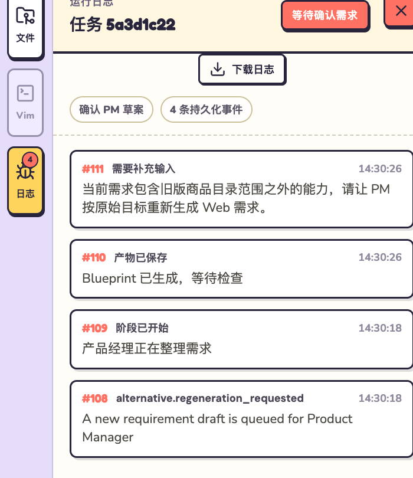
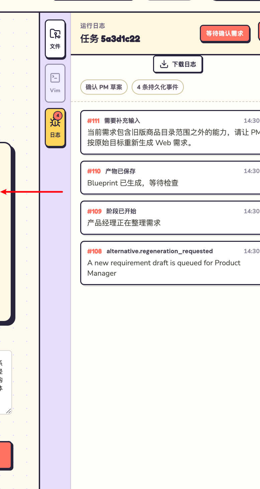
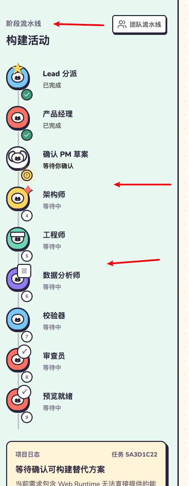

# 【产品】V1 Studio 工作区信息与侧栏重构

[toc]

> 类型：产品｜状态：待处理｜日期：2026-07-14｜范围：V1 Studio 项目工作区

- 代码基线：2026-07-14 工作区（`studio/src/App.tsx`、`studio/src/components/RepositoryPanel.tsx`、`studio/src/styles.css`）
- 检查方式：实际本地界面观察与对应渲染代码核对

## Update｜2026-07-15 桌面工作区滚动边界修复

Engineer 执行页出现浏览器全局滚动、左侧阶段内容被整体滚走、右侧文件栏与中间加载态顶部错位。代码核对确认：Workspace 只设置最小高度，常驻 Project Chat 后又渲染一个整屏高度的阶段状态，且中间列没有独立滚动容器，最终由 `body` 承担三栏内容滚动。

本次将桌面 Project Workspace 限定在顶部栏以下的可视区内：左侧阶段流水线、中间阶段区域和右侧工具区分别管理高度与滚动；Project Chat 保持常驻，其历史区域继续独立滚动；窄屏堆叠布局仍使用自然页面滚动。长期交互边界已同步到[常驻流式对话与执行期间输入控制](../../design/V1/产品设计/07-常驻流式对话与执行期间输入控制.md#21-滚动边界)。

自动化证据：布局回归测试 `tests/unit/test_studio_workspace_layout.py` 通过，Studio `npm run lint` 与 `npm run build` 通过。实际页面的滚动位置、滚轮手感和窄屏行为由用户继续验收，因此本文仍保留在`待办`。

## Update｜2026-07-14 实现

已完成代码改造：主流程项目日志移除重复事件列表和数量，只保留当前阶段、最新用户可读事件与时间；左侧项目栏支持收起、展开和本机状态记忆；右侧三类工具支持拖动调宽、全屏、退出全屏及 `Escape` 退出；阶段流水线桌面宽度从 270px 收窄到 220px。

验证证据：

- `npm run build`：通过；
- `npm run lint`：通过；
- `git diff --check`：通过；
- 本地 `/api/health`：HTTP 200，Studio 已返回本次构建生成的新静态资源 hash。

应用内浏览器当前没有可连接实例，不能判断实际点击、拖动手感和全屏视觉是否通过。因此本文继续留在待办；刷新本地页面完成实际界面验收后再归档。

## 1. 检查结论

当前工作区同时存在信息重复和固定栏宽占用：阶段流水线中的“项目日志”重复展示右侧日志面板的 RunEvent；左侧项目栏不能主动收起；右侧文件、Vim、日志面板只能使用固定宽度；阶段流水线列也宽于其内容实际需要。结果是主工作区被三侧固定区域持续挤压，而用户当前需要处理的内容没有获得优先空间。

本次重构只调整信息层级和布局控制，不改变 RunEvent 持久化、构建状态机、项目选择、文件读写、Vim 或日志下载语义。

## 2. 现场证据

### 2.1 主流程与日志面板重复

`ProjectLog` 接收当前 Run 的全部 `events`，展示状态摘要、事件数量和最近 5 条事件；`RunLogPanel` 接收同一组 `events`，展示完整倒序事件、序号、时间和下载入口。两处不是不同来源，而是同一事实的重复渲染。

### 2.2 右侧工具栏固定宽度

当前右侧工具栏关闭时宽 48px，打开后固定为 368px。用户不能根据文件内容、日志长度和屏幕大小调整，也不能临时全屏检查文档或日志。

### 2.3 阶段流水线占宽

阶段列固定为 270px，但每个阶段实际只需要角色图标、阶段名和状态。右侧存在连续空白，同时下方又嵌入较大的项目日志卡片，进一步拉长并加重该列。

## 3. 代码证据

- [`ProjectLog`](../../../studio/src/App.tsx#L1025) 使用 `events.slice(-5).reverse()` 再次渲染最近事件。
- [`RunLogPanel`](../../../studio/src/App.tsx#L1324) 使用同一 `events` 渲染完整倒序日志，并提供序号、时间和下载。
- [`RepositoryPanel`](../../../studio/src/components/RepositoryPanel.tsx#L11) 只维护打开的工具类型，面板宽度由 CSS 固定。
- [`workspace-grid`](../../../studio/src/styles.css#L318) 固定使用 `270px minmax(0, 1fr) auto`，右侧打开宽度固定为 368px。

## 4. 重构结论

### 4.1 主流程只回答“现在该做什么”

- 阶段列保留紧凑状态摘要：当前状态、最后一条用户可读事件和更新时间。
- 删除主流程中的最近事件列表与事件数量，不再复制完整历史。
- 完整 RunEvent、序号、时间和下载统一留在右侧日志面板。
- `alternative.regeneration_requested` 等内部事件必须转换为用户可读文案；无法转译的原始事件名只作为调试信息，不作为主流程标题。

### 4.2 左侧项目栏可收起

- 桌面端支持主动收起和展开，并记住本机选择。
- 收起后保留窄工具轨道、新建项目、项目图标和展开入口；项目名称、配额和账号详情隐藏。
- 项目切换、创建、管理后台和退出登录行为不变。

### 4.3 右侧工具栏可调宽并可全屏

- 文件、Vim 和日志共用一个可拖动左边缘，向左拖动扩大、向右拖动缩小。
- 宽度受到最小可用宽度和当前视口限制，不能拖成不可操作状态。
- 打开工具时提供全屏与退出全屏按钮；全屏不改变当前工具、选中文件或未保存草稿。
- 关闭工具后退出全屏；再次打开仍使用最近一次普通宽度。

### 4.4 阶段流水线收窄

- 桌面端阶段列从 270px 收窄到能容纳头像、阶段名称和状态的宽度。
- 主内容仍允许 `minmax(0, 1fr)` 扩展，右侧工具栏拖动时优先压缩主内容，不让阶段名称溢出。
- 移动端继续使用横向阶段列表，不引入新的固定侧栏。

## 5. 验收标准

1. 主流程不再出现“最近事件”列表和“持久化事件数量”；右侧日志面板仍完整展示全部事件并可下载。
2. 当前状态仍能说明用户下一步动作，最新事件和时间保持可见；新增重生成事件显示中文。
3. 左侧项目栏可以收起、展开，刷新后保持选择；收起状态仍可新建和切换项目。
4. 右侧文件、Vim、日志面板可通过拖动调整宽度，并可以进入和退出全屏。
5. 工具全屏前后的 active tool、文件选择和编辑草稿不丢失。
6. 阶段流水线明显收窄，角色名和状态在桌面宽度下不截断。
7. 前端生产构建通过，并在实际浏览器中完成收起、拖动、全屏和日志去重检查。

## 6. 归档条件

代码完成后在本文顶部追加 dated Update，记录前端构建结果和浏览器截图或操作证据；全部验收标准通过后移入归档。
