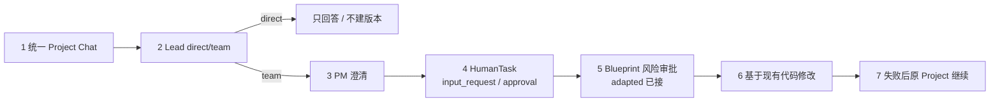

# 【检查】V1 统一 Chat 与 HITL 核心纵切检查

[toc]

> 类型：检查｜状态：部分完成｜日期：2026-07-14｜范围：V1 统一 Project Chat、Lead 路由、PM 澄清、HumanTask、已有代码修改与失败继续

- 设计基线：[V1 统一 Chat 与 Human-in-the-loop](../../design/V1/产品设计/06-统一Chat与Human-in-the-loop.md)
- 相关设计：[通过对话修改现有项目](../../design/V1/产品设计/03-通过对话修改现有项目.md) · [基于现有代码的对话式 AI Coding](../../design/V1/技术设计/02-[Agent]-基于现有代码的对话式AI-Coding.md)
- 前次相关检查：[16｜综合｜对话式 AI Coding 实现检查](./16-[综合]-2026-07-14-对话式AI-Coding实现检查.md)（其顶部已追加本轮实现进度；本文按合并设计 06 做里程碑核对）
- 代码基线：2026-07-14 工作区（`HumanTask`、Orchestrator、`routes.py`、Studio `App.tsx`、`tests/integration/test_human_tasks.py`、`tests/integration/test_project_change_chat.py`）

## 1. 检查结论

[设计 06](../../design/V1/产品设计/06-统一Chat与Human-in-the-loop.md) 将七项需求合并为一条 Project Chat + 通用 HITL 主链路。本轮已完成**设计落库与核心纵切实现**：持久化 HumanTask、PM 澄清后同 Run 恢复、Lead `direct`/`team` 路由、基于当前版本的修改、失败后在原 Project 继续，以及 AI / Edit / Vim 共用写边界；Studio 可展示 PM 问题、补充、审批与失败继续。

自动化验证：后端 107 项测试通过；Studio ESLint 与生产构建通过；`git diff --check` 通过。

本 Review **暂不归档**：Stop/Cancel、富 Diff 卡片、完整 Risk Policy 适配器、VersionMaterialization、消息幂等 key、完整 Markdown ProductSpec 与 V2 动态任务图仍明确排除在本纵切之外，需有后续关闭证据或版本边界决定。

下图回答：「合并设计的七项需求里，哪些已进入当前可运行纵切？」

**读图要点：** 1–4、6–7 已贯通主路径；5 已接 adapted Blueprint 的 `approval` HumanTask，但额外预算、破坏性 Diff 等完整 Risk Policy 适配器仍待做；图右侧未画出的 Stop/Cancel、富 Diff、VersionMaterialization 属于设计 §7 明示边界。

## 2. 七项合并需求对照

| # | 需求 | 本轮状态 | 证据要点 |
| --- | --- | --- | --- |
| 1 | 统一 Project Chat | 已实现 | 首次构建、修改、PM 问题/回复、失败记录写入同一 Project 消息时间线 |
| 2 | Lead `direct` / `team` 路由 | 已实现 | Project 消息先经 Lead；`direct` 不建版本；`team` 进入修改/构建流水线 |
| 3 | PM 对话式需求澄清 | 已实现 | PM `needs_input` → 持久化 `input_request`；用户回复后恢复同一 Run 的 PM 阶段 |
| 4 | 通用 HumanTask / HITL | 已实现（两种 kind） | `input_request` 与 `approval` 共用归属、CAS 决策、stale 与审计写入 |
| 5 | Blueprint 风险审批 | 部分实现 | adapted Blueprint 登记 `approval`；完整 Risk Policy（额外预算、破坏性 Diff 等）未完 |
| 6 | 基于现有代码继续修改 | 已实现 | 绑定当前 `ProjectVersion` + Git commit；SourceDiff + `ai_edit` 版本 |
| 7 | 失败后保留上下文并在原 Project 继续 | 已实现 | 保留 Artifact / 错误 / 成功版本；首轮失败与 `ai_edit` 失败均不强制新建 Project |

## 3. 已确认实现

### 3.1 HumanTask 与 PM 澄清

- 持久化 `HumanTask`，支持 `input_request` 与 `approval`。
- PM 信息不足时 Run 进入 `needs_input`，Chat 展示聚焦问题；用户回复后 CAS 恢复**同一个** Run，不新建无关构建。
- 重复 / 并发回复只有一次生效；非归属用户无法读取或处理任务。
- 等待期间基线版本变化后，相关 HumanTask 进入 `stale`。
- 测试：`tests/integration/test_human_tasks.py`（同 Run 恢复、重复回复、越权）。

### 3.2 Lead 路由与已有代码修改

- 已有 Project 消息先经过 Lead：`direct` 只回答、不创建版本、不占写锁；`team` 才进入修改流水线。
- 修改基于提交时的当前 ProjectVersion 与 Git commit；成功创建 `ai_edit` 版本，不自动改发布指针。
- 测试：`test_project_chat_direct_answer_does_not_create_a_version` 等（`test_project_change_chat.py`）。

### 3.3 失败继续与写边界

- 首次构建失败后可在原 Project Chat 修正需求并启动新 Run，不再新建第二个 Project。
- 失败 Artifact、错误消息与上一成功版本继续保留；`ai_edit` 重试不再误走首页 `createRun`。
- AI 修改、结构化 Edit、Vim Save 共用 Project 单写边界；等待 PM 补充时释放写占用，恢复写入前重新取得并复查基线。
- 写占用与基线变化分别返回 `PROJECT_WRITE_BUSY` 与 `BASE_VERSION_CHANGED`。
- 测试：首轮失败同 Project 继续、等待澄清后基线失效、Edit/Vim/AI 写互斥（见 `test_project_change_chat.py`、`test_repository_and_sandbox.py` 相关用例）。

### 3.4 Studio

- 支持 PM 问题、用户补充、审批、失败继续与持久化消息展示。
- 消息加载错误可见；历史为可滚动展示（相对 Review 16 原「仅 4 条且静默失败」已推进）。

### 3.5 与 Review 16 的关系

[Review 16](./16-[综合]-2026-07-14-对话式AI-Coding实现检查.md) 顶部 dated Update 已记录：`product_running` 恢复、写边界、失败继续、错误语义、Lead/PM HITL、Studio 等修复。本文不重复改写 16 的历史发现正文；关闭 16 时需逐项对照 Update 与测试证据。

## 4. 验证结果

| 项 | 结果 |
| --- | --- |
| 后端测试 | 107 项全部通过 |
| Studio ESLint | 通过 |
| Studio 生产构建 | 通过 |
| `git diff --check` | 通过 |

设计 06 §8 验收标准中，主链、同 Run 恢复、CAS、归属、等待不长期占锁、`direct` 不建版本、失败保留上下文等，已有自动化用例覆盖；完整 Risk Policy 与 Stop 仍属 §7 边界外。

## 5. 本轮未包含（明确边界）

下列项**不得**因本纵切完成而被表述为已交付：

| 项 | 说明 |
| --- | --- |
| 通用 Stop / Cancel API | 产品要求修改期间可停；尚无完整取消与配额结算路径 |
| 富 Diff 对话卡片 | SourceDiff 仍以 Artifact 为主；Chat 内独立 Diff 卡片未做 |
| 完整 Risk Policy 适配器 | 额外预算、破坏性 Diff 等业务规则未齐；不仅限于 adapted Blueprint 审批 |
| VersionMaterialization | Git commit 与 DB 版本对账表未落地 |
| 消息幂等 key | 防重复提交的 `idempotency_key` 未落地 |
| 完整 Markdown ProductSpec 工作流 | 当前可执行 Contract 仍是 Blueprint；不暗示 ProductSpec 代际已交付 |
| V2 动态任务图与并行 Agent | 仍属 V2；V1 保持固定流水线 |
| `BASE_SOURCE_MISMATCH` / 外部仓库导入 | 对话式修改技术设计后续项，不在本合并纵切宣称范围 |

## 6. 处理要求

1. 本 Review 保持**待办 / 部分完成**，直到 §5 各项分别：修复并有验证证据、回写 Design 后关闭，或明确记为版本边界。
2. [Review 16](./16-[综合]-2026-07-14-对话式AI-Coding实现检查.md) 在已修复项有充分测试证据后可单独追加 Update 并评估归档；未关闭项（如 Stop、Diff 卡片、VersionMaterialization）与本文 §5 对齐，避免两处说法分叉。
3. 长期生效结论以 [设计 06](../../design/V1/产品设计/06-统一Chat与Human-in-the-loop.md) 为准；本文件只记录检查结论与验证证据，不维护第二套设计。
4. 全部遗留关闭后，在本文顶部追加 dated Update 与证据链接，再移入归档。
