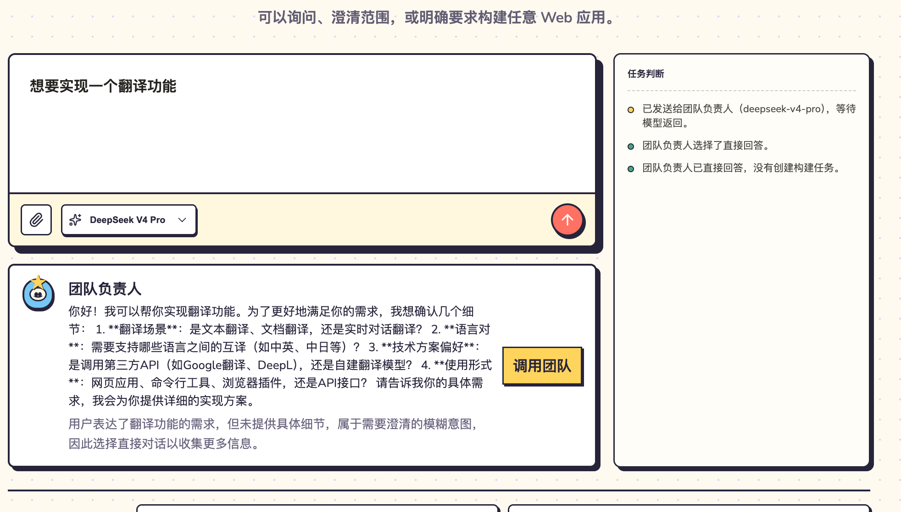

# 首次需求结构化澄清检查

[toc]

> 类型：产品检查｜状态：待验证｜日期：2026-07-14｜版本范围：V1 首次创建入口

- **产品设计：** [统一 Chat 与 Human-in-the-loop](../../design/V1/产品设计/06-统一Chat与Human-in-the-loop.md)
- **Agent 设计：** [首次需求结构化澄清](../../design/V1/技术设计/07-[Agent]-首次需求结构化澄清.md)

> **2026-07-14 实现 Update：** 首次 Lead Contract 已扩展为 `direct | clarify | team`；`clarify` 返回经 Schema 校验的结构化单选问题，Studio 只有在全部问题完成后才启用“下一步”，并将原始需求和按问题顺序组成的选择结果作为首次 Run Prompt 交给 PM。Mock 路由、Contract 非法组合和“不创建 Project”路径已有自动化覆盖；Ruff、129 项后端测试和 Studio 生产构建通过。部署环境视觉验收尚未完成，本文保持待办。

## 背景

用户输入“想要实现一个翻译功能”后，Lead 判断需求尚不具体，但当前 Contract 只有 `direct | team`。模型因此把澄清问题塞进一段自由文本，并在同一张卡片上提供“调用团队”。用户既不能逐项选择，也不清楚点击后会以哪些条件进入 Product Manager。

本检查只处理首次创建入口的需求澄清，不改变已有 Project Chat 的 `answer | clarify | propose_change` 和“修改代码”授权规则。

## 摘要

- **[P1｜澄清与回答混用]** 模糊构建意图被记录成直接回答，任务日志也显示“没有创建构建任务”，无法表达“正在等待用户补齐构建条件”。
- **[P1｜自由文本不可操作]** Lead 在正文中一次列出多项问题，界面没有结构化选择、完成条件和明确的下一步。
- **[修正方向]** 首次 Lead 路由扩展为 `direct | clarify | team`；`clarify` 返回一至四个结构化单选问题，用户完成选择后点击“下一步”。
- **[边界]** “下一步”只把原始需求和结构化选择交给 Product Manager，不等于批准 ProductSpec，也不允许 Lead 直接开始工程阶段。

## 1. 问题证据

图中存在三个可验证问题：

1. Lead 实际在澄清需求，但右侧任务判断将其记为“选择了直接回答”。
2. 翻译场景、语言对、技术方案和使用形式被写进一个长段落，用户无法直接选择。
3. 唯一操作是“调用团队”，没有展示已选择内容，也没有说明进入下一步后由 PM 形成可确认的产品文档。

## 2. 修正结论

首次创建入口使用三种互斥结果：

- `direct`：回答真实问题，不创建 Project 或 Run；仍可由用户显式覆盖为调用团队。
- `clarify`：返回结构化问题，不创建 Project 或 Run；用户完成所有必选项后才能进入下一步。
- `team`：需求已经明确到可以交给 Product Manager，创建 Project 和首次 Run。

结构化澄清遵守以下规则：

1. 只询问会实质改变产品形态、核心流程或能力边界的选择。
2. 每轮一至四个问题，每个问题二至六个互斥选项；界面额外提供“暂不确定”。
3. 问题正文、选项标签和说明分别展示，不再要求前端解析 Markdown 编号列表。
4. 全部选择完成后才启用“下一步”。
5. 下一步输入由原始需求和用户选择确定性组成；PM 仍可对结构化选项未覆盖的关键事实继续澄清。
6. ProductSpec 仍需按既有规则由用户查看和确认，结构化澄清不替代该门禁。

## 3. 验收要求

1. “想要实现一个翻译功能”返回 `clarify` 和可点击选项，不显示“调用团队”。
2. 未完成所有问题时“下一步”禁用；选择“暂不确定”视为有效回答。
3. `clarify` 不创建 Project、Run、BuildJob 或 ProjectVersion。
4. 点击“下一步”后只创建一个首次 Run，其 Prompt 同时包含原始需求和结构化选择。
5. 真实问题继续走 `direct`；已经明确的构建要求继续走 `team`。
6. 中文和英文界面均能完成选择，移动端不出现横向溢出。

## 4. 待验证项

代码实现和自动化验证完成后，需要在部署环境重新使用本图中的输入验收结构化选择、下一步 Prompt 和 ProductSpec 确认链路；未完成部署验收前本文保持待办。
