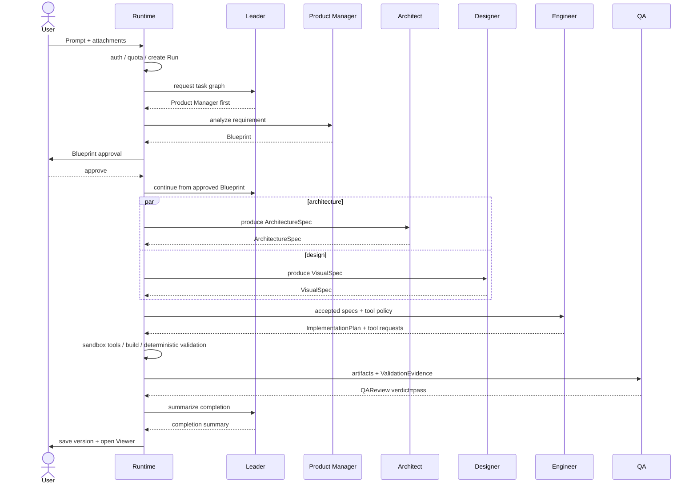

# Another Atom V2 角色与编排设计

[toc]

- 文档状态：V2 角色专题设计稿，不是当前实施基线
- 更新日期：2026-07-11
- V1 基线：[V1 架构设计](../v1/architecture-design.md)
- V1 产品范围：[V1 产品需求文档](../v1/another-atom-v1-prd.md)
- 参考分析：[Atoms 参考产品功能分析](../reference/atoms-reference-analysis.md)

## 1. 设计结论

V1 和 V2 使用相同的核心产物与可观测模型，但编排方式不同：

```text
V1: Fixed Sequential Role Pipeline
Product Manager -> Designer -> Engineer -> QA
平台状态机固定顺序；角色不动态委派、不并行、不协商

V2: Autonomous Multi-Agent System
Leader -> Product Manager / Architect / Designer / Engineer / QA
动态委派、局部并行、结构化回退、仲裁与收敛
```

V2 采用 **1 个 Leader + 5 个专业 Agent**。Designer 保持独立角色，不并入 Architect：技术结构与视觉/交互设计回答的是不同问题，合并后 Architect 职责过载，也会破坏 V1 已验证的 VisualSpec 交接契约。

V2 的“自主”有严格边界：Agent 可以提出分派、回退和修订建议，但用户审批、身份归属、配额事务、工具权限、轮次上限和 Publish 仍由平台 Runtime 强制执行。

## 2. V1 到 V2 的角色映射

| V1 | V2 | 变化 |
| --- | --- | --- |
| 平台 Sequential Orchestrator | 平台 Orchestrator Runtime + Leader Agent | Runtime 继续执行硬规则；Leader 增加推理式规划与仲裁 |
| Product Manager Agent | Product Manager Agent | 保留需求结构化职责，并扩展澄清和范围管理 |
| 无独立 Architect | Architect Agent | 新增技术结构、数据契约和可行性判断 |
| Designer Agent | Designer Agent | 保留 VisualSpec 与交互设计职责 |
| Engineer Agent | Engineer Agent | 从结构化 AppSpec 生成扩展到沙箱内实现与修复 |
| QA Agent + Validator | QA Agent + Validator | 保留确定性门禁，增加测试规划和根因判断 |

V1 的角色名称不需要为了 V2 提前修改。V2 通过稳定 Artifact Contract 接续 V1，而不是假设两版拥有完全相同的 Agent 数量、名称或上下文。

## 3. 控制权分层

V2 必须区分用户权力、平台硬控制、Leader 推理和专业角色判断。

| 控制层 | 可以决定 | 不能决定 |
| --- | --- | --- |
| User | Blueprint 确认、范围变更、破坏性操作、Publish/Update | 不直接篡改运行状态和配额账本 |
| Orchestrator Runtime | 身份归属、配额、权限、超时、并发、轮次上限、状态迁移、工具执行 | 不替专业 Agent 生成产品或技术产物 |
| Leader Agent | 任务图建议、角色分派、局部并行、回退目标建议、冲突仲裁建议 | 不绕过 Runtime，不代用户确认，不直接执行 Shell，不自动发布 |
| Specialist Agent | 在自身 Contract 内做专业判断并提交产物或拒收 | 不直接调用其他 Agent，不扩大范围，不修改平台策略 |

Runtime 是最终执行者。Leader 的每个决定先形成结构化 `LeaderDecision`，再由 Runtime 校验用户审批、预算、权限、状态机和收敛策略。

## 4. 角色总览

| 角色 | 核心问题 | 输入 | 输出 |
| --- | --- | --- | --- |
| Leader | 谁在何时处理什么，冲突如何收敛 | 用户目标、Artifacts、运行状态、预算摘要 | `TaskGraph`、`LeaderDecision`、`ArbitrationDecision` |
| Product Manager | 用户到底要什么，是否在支持范围 | Prompt、附件元数据、用户反馈 | `Blueprint`、`ClarificationRequest` |
| Architect | 产品结构如何可实现 | 已确认 Blueprint、平台能力 | `ArchitectureSpec`、`FeasibilityReport` |
| Designer | 页面如何表达和交互 | Blueprint、页面结构、品牌输入 | `VisualSpec`、`InteractionSpec` |
| Engineer | 如何在许可边界内实现 | ArchitectureSpec、VisualSpec、工具策略 | `ImplementationPlan`、Tool Requests、`BuildArtifact` |
| QA | 结果是否满足已确认 Contract | BuildArtifact、Specs、确定性 ValidationEvidence | `QAReview`、`ReworkRequest` |

## 5. Leader Agent

### 5.1 职责

- 基于用户目标和当前 Artifact 建议任务图。
- 在 Runtime 允许的范围内选择顺序或局部并行。
- 检查角色交付是否满足 Handoff Contract。
- 根据结构化证据建议回退目标。
- 对 Artifact 冲突给出可审计仲裁建议。
- 汇总用户可见进度、失败原因和待确认事项。

### 5.2 不属于 Leader 的职责

- 不直接预占、结算或释放配额；这些由 Runtime 的事务服务执行。
- 不执行文件、Shell、Build 或 Publish Tool。
- 不替 Product Manager、Architect、Designer、Engineer、QA 生成专业产物。
- 不代用户确认 Blueprint、范围变更、Restore、Unpublish 或 Publish。
- 不修改回退轮次、预算、超时和权限策略。

### 5.3 无需用户介入的建议

Leader 可以建议：

- 通过已满足 Contract 的阶段。
- 在策略上限内重试可重试失败。
- 将结构化 ReworkRequest 路由给责任角色。
- 在 ArchitectureSpec 与 VisualSpec 无依赖冲突时并行执行 Architect 和 Designer。
- 达到收敛策略后建议失败结束。

Runtime 校验建议后执行；“Leader 建议”不等于绕过策略直接写状态。

### 5.4 必须请求用户确认

- Blueprint 审批。
- 超出已确认 Blueprint 的范围变更。
- 从受控模板升级到新技术栈或新增外部依赖。
- 删除、Restore、Unpublish 等破坏性操作。
- Publish 和 Update。

## 6. 专业角色契约

### 6.1 Product Manager Agent

输入：Prompt、附件元数据、模式、当前 Clarification。

输出：`Blueprint`。

```json
{
  "schema_version": "2.0",
  "project_name": "Mono Market",
  "product_type": "product_catalog",
  "support_level": "supported",
  "pages": ["Home", "Catalog", "Product"],
  "modules": ["catalog", "product_detail", "seo"],
  "constraints": [],
  "acceptance_goals": []
}
```

边界：可以澄清和归类，不能擅自扩大产品范围；`adapted` 或 `unsupported` 必须将映射与缺失信息交给用户。

### 6.2 Architect Agent

输入：用户已确认的 Blueprint、平台能力与技术约束。

输出：`ArchitectureSpec` 与 `FeasibilityReport`。

```json
{
  "schema_version": "2.0",
  "routes": [{ "path": "/", "page": "Home" }],
  "modules": [{ "id": "catalog", "contract": "ProductList" }],
  "data_contracts": [{ "entity": "product", "source": "platform.products" }],
  "runtime_constraints": {
    "allowed_dependencies": [],
    "requires_network": false
  }
}
```

边界：负责技术结构、数据与可行性，不负责视觉风格，不得删除 Blueprint 已确认范围。发现不可实现项时提交 `ReworkRequest(root_cause=requirements)`。

### 6.3 Designer Agent

输入：Blueprint、页面结构、品牌与附件信息。

输出：`VisualSpec` 与 `InteractionSpec`。

```json
{
  "schema_version": "2.0",
  "theme": "editorial",
  "tokens": {
    "primary_color": "#111111",
    "surface_color": "#ffffff"
  },
  "responsive_rules": [],
  "interaction_states": []
}
```

边界：负责视觉、响应式和交互状态，不改变页面范围、数据契约或技术栈。

### 6.4 Engineer Agent

输入：ArchitectureSpec、VisualSpec、InteractionSpec、平台 Tool Policy。

输出：`ImplementationPlan` 和结构化 Tool Requests；Runtime 执行 Tool 后形成 `BuildArtifact`。

Engineer 不直接获得宿主机 Shell。V2 只有在独立沙箱和 Tool Policy 生效后，才能申请文件、依赖、构建和测试操作。

```json
{
  "schema_version": "2.0",
  "changes": [
    {
      "path": "src/pages/Home.tsx",
      "operation": "update",
      "artifact_refs": ["architecture:v3", "visual:v2"]
    }
  ],
  "tool_requests": ["workspace.apply_patch", "build.run"]
}
```

边界：可以决定实现细节和局部重构；新增依赖、改变 ArchitectureSpec 或扩大网络权限必须请求 Leader，由 Runtime 或用户审批。

### 6.5 QA Agent

输入：BuildArtifact、ArchitectureSpec、VisualSpec、InteractionSpec 和平台生成的 `ValidationEvidence`。

输出：`QAReview` 或 `ReworkRequest`。

```json
{
  "schema_version": "2.0",
  "verdict": "fail",
  "checks": [
    {
      "item": "route:/product",
      "status": "fail",
      "evidence_ref": "validation:route-product"
    }
  ],
  "issues": [
    {
      "severity": "blocker",
      "root_cause": "implementation",
      "target": "product-cta"
    }
  ]
}
```

QA Agent 可以设计补充检查、归类根因和建议回退，但不能修改 Specs，也不能覆盖确定性 Validator 的事实结果。

## 7. 发布门与 QA 分数

V2 不使用未经校准的单一数字分数作为发布门。

通过条件：

- 所有 mandatory deterministic checks 通过。
- blocker/error 级问题为 0。
- Specs 定义的核心路由与交互有对应 evidence。
- QAReview 没有缺失基线或未处理的范围冲突。

数值 score 可以作为排序和趋势指标，但只有在建立测试集并完成校准后才能设置阈值。当前不预设 `>=85` 等缺少依据的数字。

## 8. Handoff Contract

所有 Agent 交接都通过 Runtime 持久化，不进行不可审计的点对点私聊。

```json
{
  "schema_version": "2.0",
  "message_id": "msg_123",
  "run_id": "run_123",
  "correlation_id": "task_123",
  "from": "architect",
  "to": "engineer",
  "type": "deliver",
  "artifact_ref": "architecture:v3",
  "evidence_refs": [],
  "round": 1,
  "created_at": "2026-07-11T00:00:00Z"
}
```

规则：

- Artifact 不可原地覆盖；修订创建新版本。
- 下游必须明确 accept 或 reject，不能以自由文本隐式接收。
- reject 必须包含 `root_cause`、`reason` 和 evidence refs。
- Runtime 校验 from/to、权限、Artifact 版本、round 和预算。
- 所有 Handoff 必须可重放、可审计和幂等处理。

## 9. 正常协作流程

Blueprint 由用户确认后，Architect 与 Designer 可以局部并行；Engineer 必须等待两类产物都通过 Contract。



Publish 不在协作链路中自动发生。用户选择版本并显式触发 Publish，Runtime 独立执行发布状态机。

## 10. 回退与根因路由

Agent 不能直接调用另一个 Agent。所有 reject 和 rework 都提交给 Leader，再由 Runtime 校验和执行。

Leader 不强制沿线性链路逐级回退；当 evidence 足够时，应直接路由给最近责任角色，减少无意义转发：

| root_cause | 目标 |
| --- | --- |
| `implementation` | Engineer |
| `architecture` 或 `data_contract` | Architect |
| `visual` 或 `interaction` | Designer |
| `requirements` 或 `scope` | Product Manager，必要时请求用户 |
| `platform` | Runtime 失败处理，不交给 Agent 修复 |

```json
{
  "type": "reject",
  "from": "qa",
  "root_cause": "implementation",
  "reason": "Product CTA does not navigate",
  "evidence_refs": ["validation:product-cta"],
  "suggested_fix": "Check route binding"
}
```

如果 QA 只能怀疑根因，标记 `root_cause=unknown`，由 Leader 基于 Artifacts 建议目标；Runtime 不允许 QA 绕过 Leader 直接触发 Engineer 或 Architect。

## 11. 仲裁

角色冲突统一提交 `ArbitrationRequest`。Leader 依据以下优先级给出建议：

```text
用户已确认的 Blueprint
    > Runtime 安全与能力策略
    > 已接受的上游 Artifact Contract
    > 下游带证据的可行性反馈
    > 无证据的角色偏好
```

仲裁结果只有三类：

1. 接受回退并分派责任角色。
2. 驳回回退，要求当前角色在 Contract 内解决。
3. 涉及范围或用户意图变化，暂停并请求用户。

每次仲裁写入 `arbitration.*` 事件，包含引用的 Artifact、Evidence、建议理由和 Runtime 最终执行结果。前端展示结论和证据入口，不展示模型私有推理。

## 12. 收敛策略

轮次和预算上限属于 Runtime Policy，不由 Leader Agent 自行修改。

```text
max_total_rework_rounds
max_revisions_per_artifact
max_same_evidence_repeats
max_agent_calls
max_token_budget
run_deadline
```

原始建议中的 QA/Engineer 3 轮、Engineer/Architect 2 轮、总计 6 轮可以作为压测起点，但当前没有 V2 运行数据支持把它们写成最终产品承诺。

收敛条件：

1. Mandatory checks 全部通过且无 blocker/error，正常完成。
2. 某 Artifact 达到修订上限，升级到 Leader 仲裁或用户确认。
3. 连续两轮 evidence 和 Artifact diff 没有实质变化，提前失败止损。
4. 达到总轮次、调用数、token 预算或 deadline，失败结束。
5. 失败结束保留最近可用 Version，释放未使用配额并返回可操作错误。

Atoms 官方建议连续 2-3 轮无法修复时通过 Remix 减少旧上下文干扰，这可以支持“必须止损”的方向，但不能直接证明 V2 各回退边的具体轮次上限。

## 13. 上下文与工具权限

每个 Agent 拥有独立上下文，只接收完成当前任务所需的 Artifact 和 Evidence 摘要。

| Agent | 默认工具权限 |
| --- | --- |
| Leader | 无业务工具；只提交结构化调度与仲裁建议 |
| Product Manager | 无 Shell/文件工具；可读取用户输入和 Blueprint 历史 |
| Architect | 只读平台能力与 Contract；无写文件权限 |
| Designer | 只读品牌资产元数据；无执行权限 |
| Engineer | 通过 Runtime 申请沙箱文件、构建和测试工具 |
| QA | 只读 BuildArtifact、Preview、测试和浏览器检查工具 |

Runtime 在每次 Tool Request 前检查 Agent 身份、Project 归属、参数 schema、预算、网络策略和沙箱边界。

## 14. 状态、事件与数据模型

V2 保留 V1 的 `stage.*` 事件用于前端兼容，并新增：

```text
agent.started
agent.completed
agent.failed
handoff.created
handoff.accepted
handoff.rejected
arbitration.requested
arbitration.decided
rework.started
rework.completed
```

建议新增或扩展：

- `agent_instances`：角色、模型、Prompt 版本、工具策略。
- `agent_stage_runs`：独立 Agent 调用、输入/输出 Artifact、用量、尝试次数。
- `artifact_versions`：不可变 Artifact 版本和 schema version。
- `handoffs`：交付、接受、拒绝和 correlation ID。
- `arbitrations`：冲突、证据、Leader 建议和 Runtime 决定。
- `run_budgets`：父 Run 的调用、token、时间和并发预算。

V2 不应只给现有 Event 增加一个 `agent_id`；回退、仲裁、Artifact 版本和预算都需要独立可查询状态。

## 15. 界面呈现

### 15.1 V1

- 标注“Team Mode · 分阶段接力 / Sequential role pipeline”。
- 同一时刻只高亮一个角色。
- 每个角色展示 Blueprint、VisualSpec、AppSpec、ValidationReport/QAReview 入口。
- 不显示并行、自主协商或 Agent 私有推理。

### 15.2 V2

- 显示当前任务图、活跃 Agent、并行分支和 Handoff 状态。
- Leader 只在规划、仲裁、请求用户和完成汇总时显示为 Coordinator，不作为 V1 占位角色卡。
- 回退在原时间线上标记 Rework，不创建一条无法关联的新流程。
- 每条拒绝和仲裁显示 Artifact/Evidence 链接。
- 不展示 Chain of Thought，只展示结构化决策、结果和证据。

## 16. V1 到 V2 的升级步骤

1. 冻结并版本化 V1 Blueprint、VisualSpec、AppSpec、QAReview Contract。
2. 将 V1 Sequential Orchestrator 抽象为可持久化 TaskGraph Runtime。
3. 增加 ArtifactVersion、Handoff、Arbitration 和 RunBudget。
4. 新增 Architect Agent，并将 V1 AppSpec 拆成 ArchitectureSpec、VisualSpec 和 ImplementationPlan。
5. 为 Engineer 和 QA 建立独立沙箱与只读/写入 Tool Policy。
6. 先上线多 Agent 顺序 Handoff，再对无依赖的 Architect/Designer 开启局部并行。
7. 完成并发配额预占、取消、部分失败和恢复测试后，才开放动态任务图。

V2 不通过直接替换 `orchestrator.py` 获得；Runtime、数据模型、预算和工具隔离都必须先升级。

## 17. 已决事项与未决事项

### 17.1 本文已决

- V1 不展示 Leader；V2 Leader 在实际介入时作为 Coordinator 可见。
- V2 保留独立 Designer，形成 1 Leader + 5 Specialist Agents。
- QA 发布门以 deterministic mandatory checks 和 blocker/error 为准，不预设无依据数字阈值。
- Agent 只提出调度、工具和回退请求；Runtime 执行所有硬控制。
- Publish 始终由用户显式触发。

### 17.2 仍需在 V2 立项时确认

- 具体模型供应商、Agent SDK 和 Prompt 版本策略。
- V2 是否与 CC 式 Local Runtime 同版本交付。
- 远程沙箱实现、网络策略和依赖白名单。
- QA 是否加入视觉截图评估，以及对应测试集。
- 各回退边、总预算和 deadline 的压测结果。
- V2 产品范围、验收指标和部署成本。
